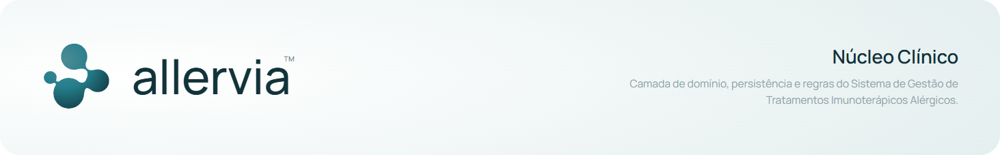

# Allervia · Núcleo Clínico

**Camada de domínio, persistência e regras do Sistema de Gestão de Tratamentos Imunoterápicos Alérgicos.**



API REST para gestão de tratamentos de imunoterapia com alérgenos. O sistema controla o ciclo completo de uma terapia: cadastro da instituição e da equipe clínica, cadastro de pacientes, prescrição da imunoterapia, agendamento automático das aplicações segundo o protocolo clínico e registro de cada dose administrada, com rastreabilidade de autoria em todas as operações.

---

## Sumário

- [Stack](#stack)
- [Arquitetura](#arquitetura)
- [Estrutura de diretórios](#estrutura-de-diretórios)
- [Segurança e autorização](#segurança-e-autorização)
- [Modelo de dados](#modelo-de-dados)
- [Regras clínicas](#regras-clínicas)
- [Como rodar](#como-rodar)
- [Variáveis de ambiente](#variáveis-de-ambiente)
- [Scripts disponíveis](#scripts-disponíveis)
- [Testes](#testes)
- [Endpoints](#endpoints)
- [Tratamento de erros](#tratamento-de-erros)
- [Fluxo de onboarding](#fluxo-de-onboarding)
- [Convenções de código](#convenções-de-código)
- [Estado atual e limitações conhecidas](#estado-atual-e-limitações-conhecidas)

---

## Stack

| Camada | Tecnologia |
| --- | --- |
| Runtime | Node.js + TypeScript 5.7 |
| Framework | NestJS 11 |
| Banco de dados | PostgreSQL |
| ORM | Prisma 7 (driver adapter `@prisma/adapter-pg` sobre `pg`) |
| Autenticação | JWT (`@nestjs/jwt` + Passport `passport-jwt`) |
| Autorização | CASL (`@casl/ability` + `@casl/prisma`) |
| Hash de senha | bcrypt |
| Validação | `class-validator` / `class-transformer` via `ValidationPipe` global |
| Documentação de API | Swagger (`@nestjs/swagger`), gerada a partir do código |
| Identificadores | ULID |
| Testes | Jest + ts-jest + Supertest + `@faker-js/faker` |
| Qualidade | ESLint + Prettier + madge (ciclos e órfãos de dependência) |

---

## Arquitetura

O back-end é um **monolito modular** organizado por **domínio de negócio**, não por camada técnica. Cada contexto delimitado (*bounded context*) é um diretório em `src/` com seus próprios controladores, casos de uso, DTOs, repositórios e, quando justificado, entidades de domínio.

### Contextos delimitados

| Contexto | Responsabilidade |
| --- | --- |
| `security` | Autenticação (login, JWT, recuperação de senha) e autorização (CASL, papéis) |
| `account` | Conta de usuário: perfil, troca de senha, ativação e arquivamento |
| `organization` | Instituição ou clínica, raiz do isolamento multi-tenant |
| `professionals` | Profissionais vinculados à organização |
| `patients` | Pacientes da organização |
| `invites` | Convites de usuários internos e registro a partir do convite |
| `treatment-protocols` | Núcleo clínico: terapias, doses e regras de protocolo |
| `infra` | Recursos compartilhados: Prisma, e-mail, exceções, filtros |

### Critério de modelagem

A estrutura interna de um módulo **não é uniforme**. A regra é única:

> Cria-se entidade de domínio quando o agregado tem **invariante** ou **máquina de estados** que se queira verificar sem depender do banco.

Consequências práticas:

- **Agregados ricos** (com entidade de domínio): `Dose` e `Immunotherapy`, no módulo clínico, e o convite, com lógica temporal própria de validade e consumo.
- **Agregados de cadastro** (sem entidade): `Patient`, `User`, `Professional`, `Organization`. Trabalham direto com os tipos gerados pelo Prisma; a validação de formato ocorre no DTO, na borda da aplicação.

O rigor de modelagem e a cobertura de teste se concentram onde o defeito custa caro, que é a regra clínica de dosagem, em vez de se diluírem em cerimônia sobre CRUD.

### Camadas

1. **Controlador**: recebe a requisição, declara a intenção de autorização, delega ao caso de uso e devolve **sempre um DTO**, nunca a entidade interna. Sem lógica de negócio.
2. **Caso de uso**: uma classe por operação (`create-dose.use-case.ts`, `archive-user.use-case.ts` e assim por diante). Orquestra entidades, repositórios e regras; aplica o escopo de autorização por registro antes de ler ou gravar; abre transação quando o fluxo grava em mais de uma tabela. Não conhece HTTP.
3. **Repositório**: contrato como classe abstrata (que serve de interface e de token de injeção) mais implementação Prisma, ambos na raiz do módulo. Exemplos: `role.repository.ts` e `prisma-user-auth.repository.ts`.
4. **Domínio**: só nos módulos que o critério justifica. Entidades puras, exceções de domínio e interfaces, sem dependência de framework.

O grafo de dependências entre módulos é unidirecional e sem ciclos, verificável com `npm run deps:circular`.

### Padrões aplicados

- **Strategy + Factory** na geração de token (`patient-token-generator` e `professional-token-generator` selecionados por `TokenGeneratorFactory` conforme `UserType`) e no fluxo de convite e registro (`invite-strategy.factory.ts`, `register-strategy.context.ts`).
- **Service com interface abstrata** para dependências substituíveis: `IEmailService`, `IPasswordHashingService`, `IJwtTokenService`, `IBuildUpPhase`, `IMaintenancePhase`.
- **Exception filter global** traduzindo exceções de domínio para HTTP.

---

## Estrutura de diretórios

```
src/
├── main.ts                     # bootstrap: ValidationPipe, filtro global, Swagger em /api
├── app.module.ts               # composição dos módulos + guards globais (JWT, Policies)
│
├── security/                   # autenticação e autorização
│   ├── auth.controller.ts      # login, password-reset
│   ├── jwt.strategy.ts
│   ├── decorators/             # @Public, @AuthenticatedOnly, @CurrentUser, @OrganizationId
│   ├── guards/                 # JwtAuthGuard, PoliciesGuard
│   ├── factories/              # TokenGeneratorFactory
│   ├── strategies/token-generator/
│   ├── use-cases/              # login, password-reset request/verify/confirm
│   ├── validation/             # regras de senha
│   └── permissions/            # CASL
│       ├── ability/            # AbilityFactory, tipos, @CheckPolicies
│       ├── roles.controller.ts
│       └── use-cases/          # grant, revoke, find, list
│
├── account/                    # perfil, senha, status do usuário
├── organization/               # cadastro e consulta da instituição
├── professionals/              # casos de uso de profissionais (sem controller próprio)
├── patients/                   # listagem, consulta e atualização de pacientes
├── invites/                    # convites + registro via convite
│   ├── domain/                 # entidade, exceções e interfaces de convite
│   └── strategies/
│       ├── invites/            # criação de convite por tipo
│       └── register/           # registro do usuário interno
│
├── treatment-protocols/
│   └── allergen-immunotherapy/
│       ├── therapies/          # Immunotherapy: entidade, casos de uso, controller
│       ├── dosing/             # Dose: entidade, casos de uso, controller
│       └── clinical-rules/
│           ├── build-up-phase/   # fase de indução
│           └── maintenance-phase/# fase de manutenção
│
├── infra/
│   ├── database/               # PrismaService + PrismaModule
│   ├── email/                  # IEmailService + LogEmailService (stub de dev)
│   ├── exceptions/             # DomainException (classe base)
│   └── filters/                # DomainExceptionFilter
│
└── utils/                      # date.utils.ts, security.utils.ts

prisma/
├── schema.prisma
└── migrations/

test/
├── database/                   # TestDatabaseManager, TestPrismaService
├── factories/                  # fábricas de dados de teste (faker)
└── app.e2e-spec.ts

docs/                           # documentação do projeto + ADRs
```

---

## Segurança e autorização

### Autenticação

`JwtAuthGuard` é registrado como `APP_GUARD` global, portanto **toda rota exige token**, salvo as marcadas com `@Public()`. O login devolve um `access_token` cujo payload carrega:

```ts
{ sub, email, type, organizationId, professionalId, roles, tokenVersion }
```

`tokenVersion` é incrementado no usuário para invalidar tokens emitidos antes de eventos sensíveis, como a troca de senha.

### Autorização secure by default

`PoliciesGuard` também é `APP_GUARD` global e roda depois do JWT. Toda rota **precisa** declarar uma de três marcações:

| Marcação | Significado |
| --- | --- |
| `@Public()` | Dispensa autenticação (login, registro por convite, cadastro da organização) |
| `@AuthenticatedOnly()` | Basta estar autenticado. Usada quando o usuário age sobre a própria conta (`/account/me`) |
| `@CheckPolicies({ action, subject })` | Declara ação e tipo de recurso; verificada contra a *ability* do usuário |

**Rota sem nenhuma das três é negada com 403.** A omissão não abre acesso: ela fecha.

### CASL

`AbilityFactory` monta as permissões a partir dos papéis ativos do profissional, sempre condicionadas ao `organizationId` do token. O isolamento entre instituições nasce da própria regra de autorização, não de um filtro adicional.

| Papel | Permissões |
| --- | --- |
| `ADMINISTRATOR` | Lê `Patient`, `Immunotherapy` e `Dose` da organização; gerencia `Professional`, `User`, `InternalUserInvite` e `ProfessionalRole`; lê a própria `Organization` |
| `PHYSICIAN` | Cria `Patient` na organização; lê, atualiza e arquiva **seus** pacientes (`responsiblePhysicianId`); gerencia `Immunotherapy` desses pacientes; lê, cria e atualiza as `Dose` correspondentes |
| `NURSE` | Lê `Patient` e `Immunotherapy` da organização; lê, cria, atualiza e arquiva `Dose` da organização |
| `RECEPTIONIST` | Lê, cria e atualiza `Patient` da organização |

A verificação no guard é sobre **ação mais tipo de recurso**. O escopo por registro individual (o `where` da consulta) é responsabilidade do caso de uso, que incorpora as condições da *ability* antes de ler ou gravar. É por isso que existe `@casl/prisma`, que converte as condições CASL em filtro Prisma.

---

## Modelo de dados

Todos os identificadores são ULID. Os agregados relevantes carregam autoria (`createdById`, `updatedById`, `archivedById`) e arquivamento lógico (`isArchived`) em vez de exclusão física.

- **Organization**: raiz do tenant. Agrega profissionais, pacientes, convites e log de auditoria.
- **User**: credenciais e tipo (`PROFESSIONAL` ou `PATIENT`), com `tokenVersion` para invalidação de sessão.
- **Professional**: vincula `User` a `Organization`; guarda profissão, conselho e UF.
- **ProfessionalRole**: concessão de papel com trilha completa, `grantedAt`/`grantedById` e `revokedAt`/`revokedById`. Papel revogado não é apagado.
- **Patient**: vinculado à organização e ao médico responsável; peso e data de nascimento alimentam o cálculo clínico.
- **Immunotherapy**: raiz do agregado clínico. Tipo, via de administração (`SUBCUTANEOUS` ou `SUBLINGUAL`), extrato, concentração e volume alvo, datas de início de indução e manutenção, status (`IN_PROGRESS`, `SUSPENDED`, `COMPLETED`).
- **Dose**: concentração, volume, data prevista, data efetiva, intervalo até a próxima e status (`SCHEDULED`, `ADMINISTERED_ON_SCHEDULE`, `ADMINISTERED_OFF_SCHEDULE`, `ENTERED_IN_ERROR`).
- **DoseObservation**: observações pré e pós-administração (efeitos colaterais, medicações), única por `(doseId, phase)`.
- **VerificationToken**: token de uso único para `PASSWORD_RESET` e `EMAIL_CHANGE`, com `expiresAt` e `consumedAt`.
- **InternalUserInvite**: convite com token único, papel pretendido, validade e consumo; único por `(email, organizationId, isActive)`.
- **AuditLog**: `entityType`, `entityId`, `action`, `oldValues`, `newValues`, `changedFields`, indexado por entidade, usuário, organização e tempo.

Schema completo em `prisma/schema.prisma`.

---

## Regras clínicas

A imunoterapia com alérgenos progride em duas fases, implementadas em `treatment-protocols/allergen-immunotherapy/clinical-rules/`. Registrada a terapia, o sistema cria a dose inicial e, a cada aplicação registrada, agenda automaticamente a próxima.

**Fase de indução (build-up)**, em `build-up-phase.variables.ts`:

- concentração da dose inicial: `10000`
- volume da dose inicial: `0.1`
- intervalo entre doses: `7` dias

**Fase de manutenção**, em `maintenance-phase.variables.ts`, com intervalos progressivos:

- primeiro: `14` dias
- segundo: `21` dias
- terceiro: `28` dias

A entidade `Dose` concentra a máquina de estados: decide quando uma aplicação pode mudar de situação, o que ocorre ao ser marcada como registro equivocado (`ENTERED_IN_ERROR`) e como a aderência ao protocolo é derivada da comparação entre `scheduledAt` e `administeredAt`, daí a distinção entre `ADMINISTERED_ON_SCHEDULE` e `ADMINISTERED_OFF_SCHEDULE`. Por ser pura, é exercitada em teste sem infraestrutura.

---

## Como rodar

### Pré-requisitos

- Node.js 20+
- PostgreSQL acessível (local ou remoto)
- npm

### Instalação

```bash
git clone https://github.com/anaperinii/imunecare-backend.git
cd imunecare-backend
npm install
```

### Configuração

Crie um `.env` na raiz (veja a seção seguinte) e prepare o banco:

```bash
npx prisma generate      # gera o Prisma Client
npx prisma migrate dev   # aplica as migrations
```

### Execução

```bash
npm run start:dev        # watch mode
npm run start            # execução simples
npm run build && npm run start:prod   # produção
```

A API sobe em `http://localhost:3000` (ou na porta de `PORT`). O Swagger fica em **`http://localhost:3000/api`**.

---

## Variáveis de ambiente

| Variável | Obrigatória | Descrição |
| --- | --- | --- |
| `DATABASE_URL` | sim | String de conexão PostgreSQL. Lida pelo `PrismaService` e pelo `prisma.config.ts` |
| `JWT_SECRET` | sim | Segredo de assinatura do JWT |
| `JWT_EXPIRES_IN` | sim | Expiração do token (por exemplo `1d`, `8h`) |
| `SUPER_ADMIN_REGISTRATION_KEY` | sim | Chave de bootstrap que autoriza a concessão do primeiro papel de administrador via rota pública |
| `PORT` | não | Porta HTTP. Padrão: `3000` |

Para testes de integração, as mesmas variáveis vão em `.env.test.local`, apontando para um **banco separado**, com `NODE_ENV=test`.

> `.env` e `.env.test.local` não devem ser versionados com valores reais. Trate `JWT_SECRET` e `SUPER_ADMIN_REGISTRATION_KEY` como segredos: quem tem a chave de bootstrap consegue se tornar administrador de uma organização.

---

## Scripts disponíveis

| Script | O que faz |
| --- | --- |
| `npm run start:dev` | Sobe em watch mode |
| `npm run start:debug` | Sobe em watch mode com debugger |
| `npm run start:prod` | Executa o build de `dist/` |
| `npm run build` | Compila com o Nest CLI |
| `npm run lint` | ESLint com `--fix` |
| `npm run format` | Prettier em `src/` e `test/` |
| `npm test` | Roda toda a suíte Jest |
| `npm run test:watch` | Jest em watch |
| `npm run test:cov` | Cobertura (`coverage/`) |
| `npm run test:integration` | Só integração, com `.env.test.local` |
| `npm run test:setup` | `prisma db push` mais `generate` no banco de teste |
| `npm run test:clean-setup` | `prisma migrate reset` mais `generate` no banco de teste |
| `npm run test:e2e` | Suíte end-to-end (`test/jest-e2e.json`) |
| `npm run deps:circular` | Detecta dependências circulares (madge) |
| `npm run deps:orphans` | Lista módulos órfãos |
| `npm run deps:graph` | Gera `docs/deps.svg` |
| `npm run deps:json` | Gera `docs/deps.json` |

---

## Testes

A estratégia é deliberada: **teste unitário onde há lógica pura, teste de integração contra banco real onde há persistência.**

- **Unitário**: entidades de domínio e serviços puros, instanciados diretamente, sem infraestrutura.
- **Integração**: a maior parte da suíte. Vive em `use-cases/tests/integration/` dentro de cada módulo e roda contra PostgreSQL real. A razão é concreta: as falhas típicas dessa camada são de mapeamento entre código e banco, restrição de unicidade, integridade referencial e comportamento transacional, e nenhuma delas é alcançada por mock.

Infraestrutura de teste em `test/`: `TestDatabaseManager` e `TestPrismaService` cuidam de conexão e limpeza; as fábricas em `test/factories/` (organização, usuário, paciente, imunoterapia, dose, convite) montam dados com faker.

`jest.config.ts` roda com `maxWorkers: 1`, obrigatório para testes que compartilham banco, e `testTimeout: 30000`. Os aliases `src/*` e `test/*` estão mapeados.

Antes de rodar integração pela primeira vez:

```bash
npm run test:setup
npm run test:integration
```

---

## Endpoints

Prefixo: raiz da aplicação. Todas as rotas exigem `Authorization: Bearer <token>`, exceto as marcadas como públicas.

### `auth`

| Método | Rota | Acesso |
| --- | --- | --- |
| POST | `/auth/login` | público |
| POST | `/auth/password-reset/request` | público |
| POST | `/auth/password-reset/verify` | público |
| POST | `/auth/password-reset/confirm` | público |

### `organization`

| Método | Rota | Acesso |
| --- | --- | --- |
| POST | `/organization/register` | público |
| GET | `/organization/:id` | `read Organization` |

### `roles`

| Método | Rota | Acesso |
| --- | --- | --- |
| POST | `/roles/register` | público, exige `SUPER_ADMIN_REGISTRATION_KEY` no corpo |
| POST | `/roles` | `create ProfessionalRole` |
| GET | `/roles/professional/:professionalId` | `read ProfessionalRole` |
| GET | `/roles/:id` | `read ProfessionalRole` |
| DELETE | `/roles/:id` | `update ProfessionalRole` (revogação) |

### `onboarding`

| Método | Rota | Acesso |
| --- | --- | --- |
| POST | `/onboarding/invites` | `create InternalUserInvite` |
| GET | `/onboarding/invites/list` | `read InternalUserInvite` |
| DELETE | `/onboarding/invites/:id` | `update InternalUserInvite` (cancelamento) |
| POST | `/onboarding/registration/:inviteToken` | público |

### `account`

| Método | Rota | Acesso |
| --- | --- | --- |
| GET | `/account/me` | autenticado |
| PATCH | `/account/update/me` | autenticado |
| POST | `/account/me/password` | autenticado |
| PATCH | `/account/update/:id` | `update User` |
| PATCH | `/account/update/stats/:id` | `update User` |

### `patients`

| Método | Rota | Acesso |
| --- | --- | --- |
| GET | `/patients` | `read Patient` |
| GET | `/patients/:id` | `read Patient` |
| PATCH | `/patients/update/:id` | `update Patient` |
| PATCH | `/patients/update/status/:id` | `archive Patient` |

### `immunotherapies`

| Método | Rota | Acesso |
| --- | --- | --- |
| POST | `/immunotherapies/register` | `create Immunotherapy` |
| GET | `/immunotherapies/list` | `read Immunotherapy` |
| GET | `/immunotherapies/patients/:patientId` | `read Immunotherapy` |
| GET | `/immunotherapies/type/:type` | `read Immunotherapy` |
| GET | `/immunotherapies/:id` | `read Immunotherapy` |
| GET | `/immunotherapies/:id/doses` | `read Dose` |
| PATCH | `/immunotherapies/:id` | `update Immunotherapy` |
| PATCH | `/immunotherapies/:id/status` | `update Immunotherapy` |

### `doses`

| Método | Rota | Acesso |
| --- | --- | --- |
| GET | `/doses/:id` | `read Dose` |
| PATCH | `/doses/:id` | `update Dose` |
| PATCH | `/doses/update/status/:id` | `update Dose` |

A referência viva e completa (DTOs, campos, exemplos) é o Swagger em `/api`.

---

## Tratamento de erros

A política evita proliferação de classes de exceção:

- **Erros de formato** são barrados pelo `ValidationPipe` global, configurado com `transform: true`, `whitelist: true` e `forbidNonWhitelisted: true`. Campo não declarado no DTO derruba a requisição em vez de ser silenciosamente ignorado.
- **Erros de aplicação** usam as exceções do próprio Nest (`ForbiddenException`, `ConflictException`, `UnauthorizedException` e afins).
- **Erros de domínio** existem apenas onde a entidade é pura e não pode depender do framework. Herdam de `DomainException` (`src/infra/exceptions/`), carregam o `HttpStatus` correspondente e são traduzidos pelo `DomainExceptionFilter` global para:

```json
{ "statusCode": 409, "message": "...", "error": "NomeDaExcecao" }
```

Mensagens ficam centralizadas em arquivos `*.messages.ts` por módulo (`auth.messages.ts`, `role.messages.ts`), não espalhadas em literais pelo código.

---

## Fluxo de onboarding

1. `POST /organization/register`: cadastro público da instituição.
2. `POST /roles/register`: concessão do primeiro papel de administrador, autorizada pela `SUPER_ADMIN_REGISTRATION_KEY`. É o único ponto em que um papel é concedido sem que um usuário autenticado já tenha permissão para tanto.
3. `POST /onboarding/invites`: o administrador convida os demais profissionais informando e-mail, nome e papel. O convite tem token único e validade.
4. `POST /onboarding/registration/:inviteToken`: o convidado define suas credenciais. O convite é validado e consumido, e o usuário, o profissional e o papel são criados na mesma transação.
5. `POST /auth/login`: a partir daí o acesso é por token, com as permissões derivadas dos papéis ativos.

---

## Convenções de código

- Nomes de arquivo em kebab-case com sufixo de papel: `*.controller.ts`, `*.use-case.ts`, `*.repository.ts`, `*.entity.ts`, `*.dto.ts`, `*.strategy.ts`, `*.messages.ts`, `*.variables.ts`.
- Um caso de uso por arquivo, uma responsabilidade por caso de uso.
- Imports internos por alias absoluto (`src/...`), configurado em `tsconfig.json` e espelhado no Jest.
- Contrato de repositório como classe abstrata, que serve de interface e de token de injeção, evitando `@Inject('TOKEN')` com string.
- Controlador nunca retorna entidade nem modelo Prisma: sempre DTO de resposta.
- Prettier e ESLint integrados; rode `npm run lint` antes de abrir PR.
- Antes do merge, `npm run deps:circular` deve sair limpo.

---

## Licença

Este é um **projeto privado e proprietário**. O `package.json` declara `"private": true` e `"license": "UNLICENSED"`, o que significa, de forma explícita, que **nenhuma licença de uso é concedida** a terceiros.

Na prática:

- **Todos os direitos são reservados.** O código-fonte, a modelagem de dados, as regras clínicas e a documentação deste repositório são de titularidade exclusiva dos autores do projeto Allervia.
- **Não há permissão** para usar, copiar, modificar, mesclar, publicar, distribuir, sublicenciar, vender ou criar obras derivadas a partir deste código, no todo ou em parte, sem autorização prévia e por escrito dos titulares.
- **O acesso ao repositório não implica cessão de direitos.** Ter acesso de leitura, seja como colaborador, avaliador acadêmico ou revisor, autoriza apenas a leitura e a avaliação; não autoriza reuso em outros projetos, publicação de trechos nem redistribuição.
- **A publicação em registro público não é liberação.** Ainda que o repositório esteja ou venha a estar visível publicamente, a ausência de um arquivo `LICENSE` mantém o código sob direito autoral integral: pela legislação de direito autoral, o que não é expressamente licenciado permanece proibido.
- **O pacote não se destina a publicação em registro npm.** `"private": true` impede a publicação acidental via `npm publish`.
- **Contribuições externas** só serão incorporadas mediante acordo prévio, e a titularidade do resultado permanece com o projeto.
- **Uso clínico real** depende de autorização expressa dos titulares e de conformidade com a LGPD e com a regulamentação sanitária e profissional aplicável. Este repositório é entregue **sem qualquer garantia**, expressa ou implícita, inclusive de adequação a finalidade específica ou de segurança clínica.

Para solicitar autorização de uso, licenciamento ou parceria, entre em contato com os titulares do projeto.
