> **Histórico:** a autenticação web foi substituída por sessão opaca. Consulte [a implementação atual](opaque-session-implementation.md). Este documento registra a arquitetura JWT anterior.

# Autenticação do Allervia — opção B

Atualizado em 27/09/2026. Este documento descreve a implementação atual em `allervia-backend` e sua integração com `allervia-web`. Substitui a opção A e sua janela residual de leitura após revogação.

## Como ler este guia

Este guia começa do zero. A **Parte I** explica os conceitos e acompanha uma pessoa usando o sistema, desde o login até a saída. A **Parte II** é a referência técnica: campos, configurações, endpoints, implantação e evidências de testes. Os nomes em inglês correspondem aos nomes encontrados no código; a explicação em português mostra o significado de cada um.

Os exemplos usam identificadores fictícios e tempos ilustrativos. Não copie os exemplos como credenciais reais. Os diagramas estão em Mermaid: visualizadores Markdown compatíveis os exibem como desenhos; o próprio bloco também permanece legível como descrição das etapas.

Percurso de leitura:

1. Entender navegador, servidor e banco, e separar autenticação de autorização.
2. Entender as três peças: JWT de acesso, refresh token e família de refresh.
3. Acompanhar login, leitura de dados, renovação e recuperação após recarregar a página.
4. Entender cookie, CSRF, MFA, concorrência entre abas e falhas.
5. Consultar os detalhes de persistência, configuração e operação.

Atalhos: [conceitos e credenciais](#conceitos), [login](#login), [requisição protegida](#requisicao), [renovação](#renovacao), [cookie e CSRF](#cookies), [abas e restauração](#abas), [prazos](#prazos), [logout e revogação](#revogacao), [falhas](#falhas), [banco de dados](#persistencia), [configuração e implantação](#configuracao), [testes](#testes).

# Parte I — Entendendo o fluxo desde o início

<a id="conceitos"></a>

## A. Quem participa e qual problema estamos resolvendo

Imagine uma profissional entrando no Allervia para consultar pacientes e registrar aplicações. O sistema precisa responder, a cada pedido: **quem está pedindo, se esse acesso ainda está ativo e se essa pessoa pode executar aquela ação sobre aquele dado**.

O **frontend**, `allervia-web`, é o programa executado pelo navegador. Ele exibe formulários, recebe cliques e apresenta respostas. O **backend**, `allervia-backend`, é o programa NestJS executado no servidor. Ele recebe pedidos, verifica as regras e acessa o **PostgreSQL**, o banco onde ficam os registros persistidos. O Prisma é a camada de código usada pelo backend para consultar e alterar esse banco.

Uma **requisição HTTP** é uma mensagem enviada ao servidor. Ela tem um método, um endereço, cabeçalhos e, às vezes, um corpo. Em `GET /patients`, `GET` indica uma consulta e `/patients` identifica a rota. Em `POST /auth/sessions`, o corpo contém os dados enviados para iniciar o login. A **resposta HTTP** traz um status e pode trazer dados em JSON, um formato textual de campos e valores.

Um **endpoint** é a combinação de método e rota. `GET /auth/sessions` lista dispositivos; `POST /auth/sessions` inicia login. Apesar do mesmo endereço, são operações diferentes.

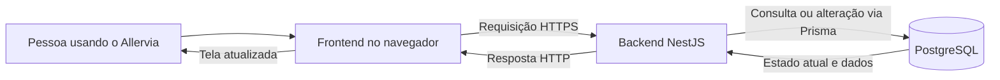

O navegador não acessa o banco diretamente. Também não decide, de forma confiável para o servidor, se alguém é administrador. Esconder um botão ajuda a experiência de uso, mas uma pessoa pode enviar uma requisição por outro programa. Por isso, a decisão de permitir ou negar acontece no backend.

### Autenticação, autorização e isolamento

**Autenticação** estabelece a identidade: “esta requisição apresenta uma credencial válida do usuário X”. **Autorização** decide a permissão: “X pode registrar uma aplicação?”. **Isolamento por organização** limita o alcance: “essa aplicação pertence à clínica à qual X tem acesso?”. As três verificações são necessárias. Ter feito login não dá permissão para qualquer operação ou qualquer clínica.

No código, um **guard** é uma etapa de verificação antes de executar a operação solicitada. O `SessionAuthGuard` verifica a credencial e o estado atual do acesso. O `PoliciesGuard` verifica as políticas de autorização. Os casos de uso e consultas também precisam respeitar a organização e o recurso pedido.

Um **caso de uso** é o código que realiza uma tarefa da aplicação, como registrar uma dose. Ele só deve ser alcançado depois das verificações aplicáveis. Um **controller** recebe a requisição e encaminha os dados para os serviços e casos de uso responsáveis.

## B. As três peças que mantêm o login funcionando

O Allervia usa três peças com responsabilidades distintas:

| Peça | O que é | Onde fica | Para que serve |
|---|---|---|---|
| Access token, em formato JWT | Texto assinado com identificadores e prazo curto | Memória do frontend | Apresentar a credencial em cada pedido protegido |
| Refresh token | Segredo aleatório, sem conteúdo legível de usuário | Cookie protegido no navegador; somente hash no banco | Obter um novo JWT sem digitar a senha novamente |
| `RefreshFamily` | Registro persistido de um login | Banco de dados | Controlar revogação, prazos, titular e evidências de autenticação |

Uma **sessão**, no sentido funcional, é o período de acesso iniciado por um login. A tabela antiga chamada `AuthSession` foi removida, mas o sistema continua tendo sessões nesse sentido. Hoje, o estado desse login é representado por `RefreshFamily`. Portanto, remover o nome de uma tabela não transformou a aplicação em um sistema sem estado de autenticação.

O termo **família** existe porque um mesmo login produz uma sequência de refresh tokens. O token inicial pode ser substituído por outro, depois por outro, mantendo a mesma família. Encerrar a família invalida o acesso ligado àquela sequência inteira.

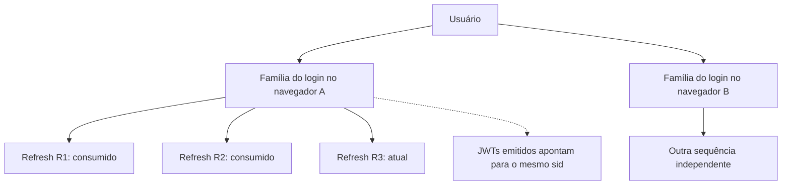

“Dispositivo” é o nome apresentado para esse login. Não é uma identificação física inviolável de um computador. Duas abas do mesmo contexto de navegador compartilham o cookie; outro navegador ou perfil pode ter outra família. Os metadados de navegador e IP ajudam a reconhecer acessos, mas não são uma prova de posse de um equipamento.

### Por que usar duas credenciais?

O JWT tem duração curta e acompanha as chamadas de dados. O refresh dura dentro dos limites do login e fica fora do alcance direto do JavaScript, em cookie HttpOnly. Isso permite manter o JWT somente em memória e reconstruí-lo depois de recarregar a página.

Não é obrigatório que todo sistema use essa arquitetura. Uma sessão opaca com consulta central também poderia atender ao produto. Aqui, a opção B preserva o fluxo de JWT e refresh já implementado, mas elimina a segunda regra de autorização que aceitava algumas leituras sem consultar o banco. O JWT, nesta opção, **não tem como benefício eliminar essa consulta**. Seu papel é representar uma credencial assinada, limitada no tempo e vinculada a um login revogável.

## C. JWT explicado campo por campo

JWT significa *JSON Web Token*. Ele contém um cabeçalho, um conjunto de informações chamado **payload** e uma assinatura. Essas partes são codificadas e separadas por pontos. **Codificar não é criptografar**: quem tiver o token consegue ler seu conteúdo. Por isso, não colocamos prontuários, doses ou outros dados clínicos nele.

A assinatura permite detectar alteração e verificar que a credencial foi emitida por quem possui a chave privada. No Allervia, o algoritmo é RS256. A **chave privada** assina e precisa permanecer secreta; a **chave pública** verifica e não permite criar uma assinatura válida. Base64, usado para transportar as chaves na configuração, também não é criptografia.

Exemplo conceitual de payload, abreviado e sem assinatura:

```json
{
  "sub": "user-example",
  "sid": "family-example",
  "org": "clinic-example",
  "iat": 1800000000,
  "nbf": 1800000000,
  "exp": 1800000300,
  "jti": "unique-issuance-example",
  "iss": "allervia",
  "aud": "allervia-api"
}
```

| Campo | Como ler | Por que existe |
|---|---|---|
| `sub` | “De quem é esta credencial?” | Deve corresponder ao usuário titular da família |
| `sid` | “A qual login ela pertence?” | Permite buscar a família e verificar se foi encerrada |
| `org` | “Para qual organização foi emitida?” | Deve corresponder à organização atual do contexto |
| `iat` | “Quando foi emitida?” | Participa da validação temporal e do limite máximo de duração |
| `nbf` | “A partir de quando pode ser usada?” | Impede aceitar uma credencial antes do início previsto |
| `exp` | “Até quando pode ser usada?” | Encerra a validade do JWT, mesmo se a família continuar ativa |
| `jti` | “Qual é esta emissão específica?” | Distingue emissões; não é uma lista de permissões nem um bloqueio persistido |
| `iss` | “Quem a emitiu?” | Impede aceitar um emissor diferente do esperado |
| `aud` | “Para qual serviço foi emitida?” | Impede aceitar uma audiência diferente da API configurada |

`iat`, `nbf` e `exp` usam segundos desde uma referência temporal padrão, chamada Unix epoch. O backend valida esses valores; o relógio do navegador não decide a aceitação pelo servidor.

O cabeçalho informa `alg=RS256`, `typ=at+jwt` e `kid`, o identificador da chave. O `kid` seleciona uma chave pública no mapa local permitido. O backend não segue uma URL arbitrária fornecida pelo token para descobrir em quem confiar.

Papéis, como médico ou administrador, não são transportados no novo JWT. Eles são carregados do banco a cada requisição. Assim, retirar um papel não exige esperar outro JWT para a nova permissão produzir efeito.

### Como o JWT é enviado

O frontend adiciona um cabeçalho como este:

```http
GET /patients
Authorization: Bearer <access-token>
```

**Bearer** significa que a posse da credencial permite apresentá-la. Não há, nesse mecanismo, prova criptográfica de que o portador é o computador original. Por isso, HTTPS, armazenamento adequado e revogação continuam necessários. Uma assinatura válida comprova a origem e integridade do token; não comprova que ele não foi copiado nem que a conta continua ativa.

<a id="login"></a>

## D. Primeiro login, passo a passo

1. A pessoa informa email e senha no frontend.
2. O cliente obtém a proteção CSRF usada no fluxo de entrada e envia a requisição de login para `POST /auth/sessions`.
3. O backend normaliza o email e verifica os limites de tentativa por conta e IP.
4. Busca o hash da senha e compara a senha apresentada com ele. A senha original não precisa estar armazenada em texto no banco.
5. Confere se a conta e a organização podem ser usadas.
6. Avalia se é necessário confirmar um segundo fator.
7. Somente depois de completar os fatores exigidos, cria a família e o primeiro refresh, e emite o JWT.
8. Envia o refresh por `Set-Cookie`. O navegador guarda esse cookie. O corpo JSON entrega o JWT, a proteção CSRF e os metadados públicos da sessão.
9. O frontend guarda o JWT em memória e passa a utilizá-lo nas chamadas protegidas.

Um **hash** é um resultado calculado a partir de um valor, projetado para não permitir recuperar o original diretamente. Para senha humana, o sistema usa a comparação de hash de senha via bcrypt. Para refresh aleatório, usa SHA-256. São entradas e necessidades diferentes: uma senha humana tende a ter menor imprevisibilidade que os 32 bytes aleatórios usados no refresh.

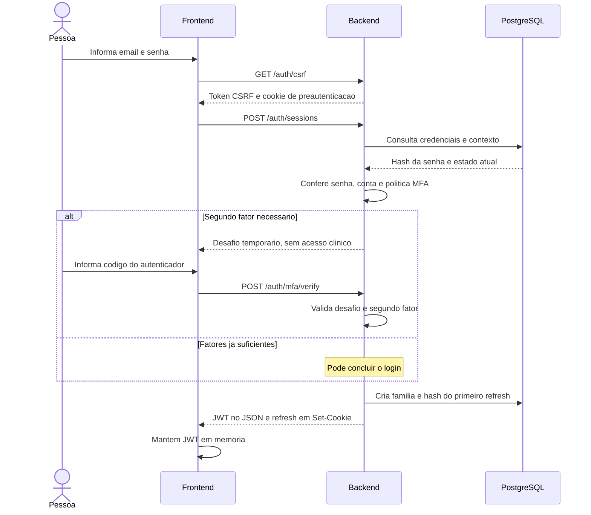

O diagrama mostra o caminho de sucesso. Senha incorreta, desafio inválido, bloqueio, limite de tentativas ou falha do servidor interrompem o fluxo antes de conceder o acesso.

### O que é MFA e por que o desafio não é um login

MFA é autenticação com mais de um fator. A senha é algo que a pessoa sabe; um código produzido pelo autenticador comprova acesso a outro segredo. O fluxo distingue `MFA_REQUIRED`, quando já há fator cadastrado, de `MFA_ENROLLMENT_REQUIRED`, quando a política exige cadastrar um fator antes de concluir a entrada.

O `challengeToken` é uma credencial temporária de pré-autenticação. Ele permite continuar aquele desafio, tem prazo e tentativas limitados e **não substitui o JWT nas rotas clínicas**. Saber a senha não libera acesso se ainda falta o fator exigido.

A política atual tem um detalhe importante: em modo `optional`, quem já tem MFA confirmado continua precisando dele. Em modo `required`, profissionais precisam concluir MFA mesmo que ainda tenham de cadastrá-lo; usuários que já possuem fator também precisam confirmá-lo. A decisão usa `hasConfirmedMfa` e a existência de `professionalId`. Portanto, o nome `required` não significa, no código atual, exigir cadastro indistintamente de qualquer tipo de usuário sem vínculo profissional.

Na configuração inicial do autenticador, a aplicação precisa apresentar um segredo ou URI para cadastrá-lo no aplicativo autenticador. Isso é uma exposição controlada para cadastro, não uma informação que deva aparecer em logs. Códigos de recuperação permitem recuperar o acesso quando o autenticador não está disponível; devem ser guardados com cuidado e não usados como senha permanente.

<a id="requisicao"></a>

## E. Consultar pacientes depois do login

Ao abrir a lista de pacientes, o navegador envia o JWT. O backend executa a mesma sequência de autenticação que executaria para uma escrita. O fato de o pedido ser `GET` não permite pular a verificação da família.

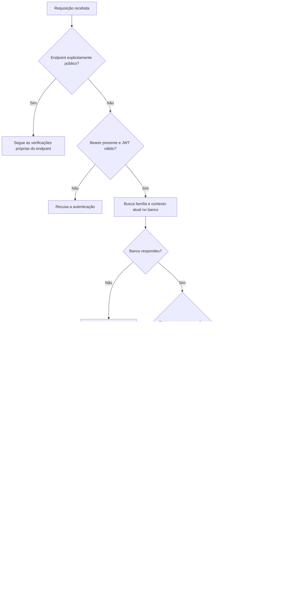

**Público** significa que o endpoint não exige um JWT de acesso já emitido. Não significa ausência de segurança. Login verifica senha; MFA verifica desafio; refresh verifica o cookie e a família; logout valida as condições da operação baseada em cookie.

Exemplo: às 10h uma profissional recebe um JWT válido até 10h05. Às 10h01 seu acesso é revogado. Uma nova validação às 10h02 encontra a família revogada e recusa o pedido. A assinatura e o prazo do JWT continuam corretos, mas são apenas parte dos requisitos.

Exemplo de autorização: a família continua válida, mas o papel necessário para uma operação foi retirado. O guard pode autenticar a pessoa, enquanto a política recusa aquela operação. **Perder uma permissão não é necessariamente perder todo o login.**

Se o banco estiver indisponível, o sistema não sabe afirmar que o acesso continua permitido. Por isso, falha sem devolver o conteúdo protegido. Esse comportamento é chamado de **fail closed**. O custo é depender da disponibilidade do banco para todas as requisições privadas; é uma decisão explícita da opção B.

<a id="renovacao"></a>

## F. O JWT expirou: renovar sem pedir a senha novamente

Expirar o JWT não significa necessariamente encerrar o login. A família pode continuar ativa, e o cookie pode conter um refresh válido. Nesse caso, o cliente solicita uma nova credencial de acesso.

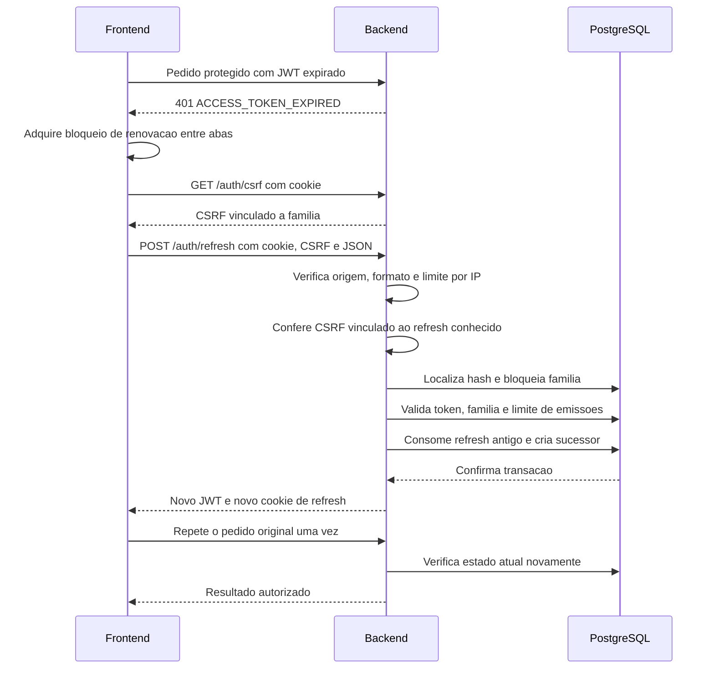

Na implementação, a conferência do CSRF ocorre antes de entrar na transação de rotação; a sequência transacional detalhada abaixo mostra a ordem interna. A chamada original com JWT expirado foi rejeitada no guard, antes de executar o caso de uso. Isso permite ao cliente repetir uma vez aquela chamada depois da renovação, preservando corpo e chave de idempotência quando houver. **Idempotência** é a propriedade de evitar efeitos duplicados quando uma operação é reapresentada sob a mesma identidade de comando.

### Por que o refresh muda a cada uso

O refresh R1 é aceito para renovar uma vez. Após sucesso, R1 recebe `consumedAt` e o navegador recebe R2. Isso se chama **rotação**. O banco conserva o hash de R1 para reconhecer se alguém voltar a apresentá-lo.

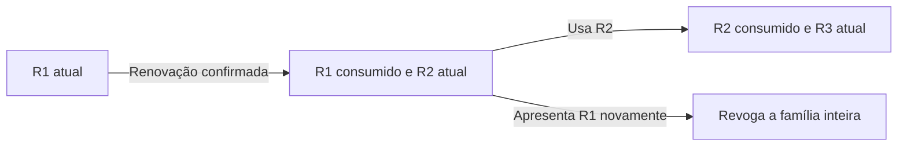

Apresentar um refresh consumido é chamado de **replay**, ou reutilização. Pode indicar uma cópia roubada ou uma repetição indevida. O backend não consegue determinar com certeza qual dessas situações ocorreu, então encerra a família. Até o JWT recém-emitido deixa de permitir novas validações, porque aponta para essa mesma família.

### Como duas renovações não criam dois sucessores

A rotação usa uma **transação**, um conjunto de alterações confirmado como unidade. Dentro dela, `SELECT ... FOR UPDATE` bloqueia a linha da família enquanto a renovação é decidida. Outra renovação da mesma família precisa esperar.

1. Localiza o refresh pelo hash.
2. Bloqueia a família e relê família e token.
3. Se a família já foi revogada, recusa.
4. Se o token já foi consumido, grava revogação e confirma essa gravação antes de devolver o erro.
5. Verifica limite de emissões, contexto atual e prazos.
6. Marca o token anterior como consumido e cria o sucessor.
7. Confirma a transação e só então devolve o novo segredo.

O índice exclusivo parcial no banco reforça que uma família não pode ter dois tokens com `consumedAt` vazio. Uma restrição no banco continua válida mesmo quando há várias instâncias do backend.

No caso de replay, lançar uma exceção dentro da transação antes de confirmar a revogação poderia desfazê-la. Por isso, o código retorna internamente um resultado de erro, confirma a transação e só depois transforma esse resultado em resposta de erro HTTP.

<a id="cookies"></a>

## G. Cookie, CSRF, CORS e HTTPS: cada proteção tem uma função

Um **cookie** é um valor que o navegador armazena para um domínio e envia automaticamente em requisições compatíveis. O backend o define pelo cabeçalho `Set-Cookie`. No Allervia, o cookie de refresh mantém a capacidade de renovar o acesso após o JWT em memória desaparecer.

| Atributo | Efeito | O que não garante sozinho |
|---|---|---|
| `HttpOnly` | JavaScript não lê o cookie por `document.cookie` | Não impede um script malicioso de fazer pedidos usando o navegador |
| `Secure` | Navegador só envia por conexão segura, ressalvadas regras de desenvolvimento do navegador | Não protege um segredo vazado por log ou código do servidor |
| `SameSite=Lax` | Restringe envio em certos pedidos entre sites | Não substitui toda a verificação de origem e CSRF |
| `Path=/` | Cookie vale para os caminhos do host | Não é uma fronteira de autorização entre endpoints |
| Sem `Domain` | Restringe o cookie ao host que o definiu | Não identifica fisicamente o dispositivo |
| Prefixo `__Host-` | Navegadores compatíveis exigem Secure, Path=/ e ausência de Domain | Não substitui validação do segredo no backend |

O cookie pode acompanhar chamadas clínicas, dependendo do destino, mas essas chamadas exigem o bearer: **o cookie sozinho não as autentica**.

### O risco de CSRF

CSRF é uma tentativa de fazer o navegador de alguém enviar uma ação indesejada aproveitando credenciais que ele inclui automaticamente. Um site externo pode tentar provocar uma requisição enquanto a pessoa está autenticada no Allervia. Como cookies são automáticos, apenas receber um cookie não prova que a ação foi iniciada pelo frontend legítimo.

A proteção combina origem permitida, formato esperado e um token apresentado no cabeçalho `X-CSRF-Token`. Na renovação, esse token é calculado com **HMAC**: uma função que combina o identificador da família com um segredo privado do servidor. O identificador da família, por si só, não permite calcular o valor válido sem esse segredo.

O CSRF não é uma segunda senha nem uma autorização clínica. Ele demonstra uma condição necessária para aceitar uma operação baseada em cookie. O endpoint que o fornece ainda depende das restrições do navegador, da configuração de origens e das outras verificações do fluxo.

Há dois contextos no código:

- **Antes do login:** `CsrfService` emite um valor aleatório no JSON e no cookie de pré-autenticação. O cliente devolve o valor no cabeçalho. Quando esse cookie está presente, o guard compara os valores. O guard genérico não exige esse cookie de clientes que não o apresentam; não se deve descrever esse mecanismo como um token obrigatório incondicional para toda rota pública.
- **Refresh e logout:** o controller tem verificações próprias. Exige origem permitida e corpo JSON; refresh exige cookie conhecido e CSRF válido. No logout, um cookie reconhecido exige CSRF antes da revogação; sem cookie reconhecido, o endpoint ainda pode limpar cookies locais. `SkipCsrf` apenas evita o guard genérico, não remove essas verificações específicas.

Nas escritas com bearer já validado, o cliente não depende do envio automático de uma credencial para se autenticar. O guard genérico dispensa a comparação CSRF, mas continua verificando a origem informada e o formato informado conforme suas regras. Em GET/HEAD/OPTIONS esse guard não aplica as verificações de escrita; isso não dispensa o guard de autenticação das rotas privadas. A ordem dos guards globais é `SessionAuthGuard`, `CsrfGuard` e `PoliciesGuard`: primeiro identidade e estado, depois proteção da requisição, depois política de acesso. Os diagramas que destacam autenticação omitem algumas dessas etapas para manter o foco.

**Origem** é a combinação de protocolo, host e porta. `http://localhost:5173` e `http://localhost:3000` são origens diferentes. **Site**, usado por SameSite, é um conceito diferente; dois subdomínios podem ser de origens diferentes e do mesmo site. Por isso, autorizar uma origem no backend não garante que o navegador aceitará todos os cookies numa hospedagem entre sites distintos.

**CORS** define quais origens o navegador pode permitir que leiam respostas da API. Não autentica a pessoa e não impede que um programa fora do navegador envie pedidos. **HTTPS** protege o transporte entre os pontos da conexão; não corrige permissões erradas. **XSS** é execução de JavaScript indevido na página: esse código pode agir no contexto do usuário, mesmo sem conseguir ler o cookie HttpOnly. As proteções se complementam.

<a id="abas"></a>

## H. Recarregar a página e abrir várias abas

O JWT fica em uma variável de memória. Recarregar a página destrói essa memória. O cookie é administrado separadamente pelo navegador e pode continuar disponível. A aplicação utiliza esse cookie para tentar reconstruir o acesso.

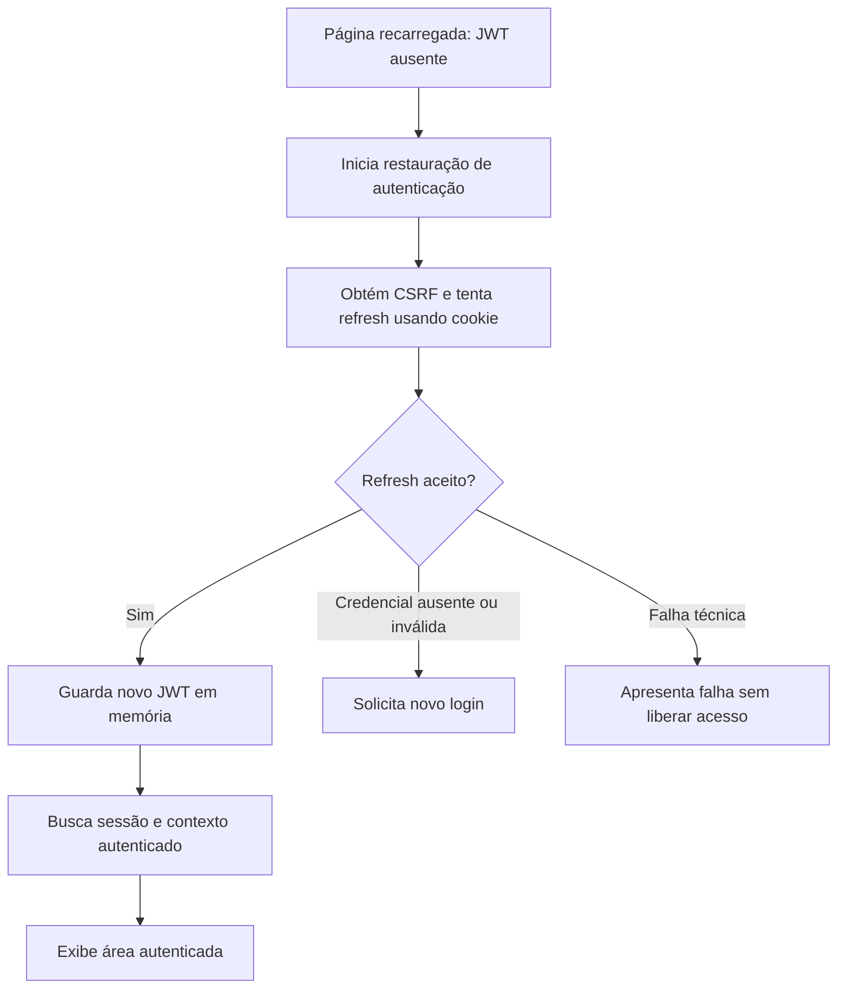

O cookie de refresh não tem um prazo persistente explícito no navegador, mas navegadores podem restaurar cookies de sessão ao restaurar uma sessão de navegação. **Fechar a janela não é um mecanismo confiável de revogação.** Os prazos conferidos no servidor e o logout confirmado são os controles efetivos.

### Por que precisamos coordenar as abas

Duas abas compartilham o cookie, mas cada uma tem sua própria memória. Se ambas tentassem usar R1 ao mesmo tempo, a primeira poderia consumi-lo e a segunda provocaria a detecção de replay. O cliente usa três recursos para reduzir esse problema:

| Recurso | O que coordena | Exemplo |
|---|---|---|
| Promessa compartilhada `refreshing` | Pedidos simultâneos na mesma aba | Três consultas esperam a mesma renovação |
| Web Locks | Operações de credenciais entre abas da mesma origem | A aba B aguarda a renovação da aba A; depois usa o cookie atualizado |
| BroadcastChannel | Eventos de encerramento entre abas | Sair em uma aba avisa as outras para limpar o acesso |

O canal não distribui JWTs ou refresh tokens. Cada aba mantém seu JWT, e o navegador mantém o cookie compartilhado. Pode haver renovações sequenciais adicionais entre abas; o objetivo do bloqueio é impedir que disputem o mesmo segredo simultaneamente.

Um contador chamado `generation` registra mudanças da autenticação local. Imagine uma consulta iniciada antes do logout que responde depois dele: o cliente compara a geração e descarta a resposta antiga. Isso evita que uma resposta atrasada restaure o estado visual da autenticação anterior.

Web Locks depende de suporte do navegador e contexto seguro. Se não estiver disponível, o cliente informa que é necessário um navegador compatível e conexão segura; não inventa uma coordenação menos confiável silenciosamente.

<a id="prazos"></a>

## I. Três relógios diferentes: JWT, inatividade e duração absoluta

Os prazos respondem a perguntas diferentes:

| Relógio | Padrão | Pergunta respondida | Como avança |
|---|---|---|---|
| Validade do JWT | Até 5 minutos | Este token específico ainda pode ser apresentado? | Um refresh pode emitir outro token |
| Inatividade | 15 minutos | A pessoa interagiu recentemente? | Atividade aceita atualiza `lastInteractiveAt` |
| Duração absoluta | 8 horas | Este login já atingiu sua duração máxima? | Não é estendida por refresh ou atividade |

Exemplo: login às 09h, última interação às 09h10. Sem nova interação, o limite de inatividade é 09h25. Uma renovação às 09h24 não concede mais quinze minutos. O novo JWT respeita esse teto e não ultrapassa o prazo absoluto da família.

Se houver interação ao longo do dia, o limite de inatividade se desloca, mas o login das 09h ainda atinge o teto absoluto às 17h com a configuração padrão. A pessoa precisa autenticar novamente.

**Polling** é quando a aplicação consulta dados automaticamente em intervalos. Polling, leituras e refresh não contam como atividade humana. Caso contrário, uma tela aberta poderia manter acesso indefinidamente sem ninguém estar usando o sistema.

O frontend envia atividade a partir de eventos de interação da aba visível, com limitação de frequência. O backend recebe `POST /auth/session/activity`, valida o acesso e só atualiza quando respeitados os limites. Esse sinal de atividade ajuda a controlar uso ocioso; não é prova inviolável de presença física de uma pessoa.

<a id="revogacao"></a>

## J. Logout, revogação e alteração de permissões

**Logout local** é retirar o JWT da memória e limpar o estado visual. **Revogação no servidor** é encerrar o registro da família no banco. Uma saída completa precisa lidar com os dois lados.

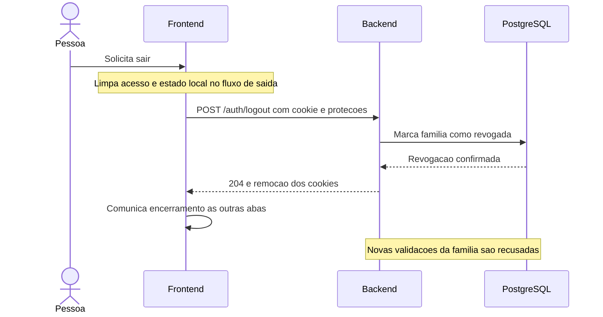

O diagrama apresenta as responsabilidades; a coordenação concreta do cliente também usa o bloqueio entre abas para evitar conflito com uma renovação em andamento.

Se a rede cair, limpar a memória não prova que o banco recebeu o logout. A interface precisa informar que a saída remota não foi confirmada e permitir nova tentativa. Se o cookie continuar válido, recarregar a aplicação pode recuperar o acesso. Essa diferença é essencial para não mostrar uma garantia que o servidor não confirmou.

| Ação | Alcance |
|---|---|
| `POST /auth/logout` | Família identificada pelo cookie atual; não depende de JWT ainda válido |
| `DELETE /auth/sessions/:id` | Família do próprio usuário selecionada na lista de dispositivos |
| `POST /auth/logout-all` | Todas as famílias do usuário autenticado |
| Bloqueio de conta ou organização | Validação atual recusa os acessos atingidos |
| Retirada de um papel | Próximas decisões de autorização usam os papéis restantes |
| Mudança da versão de autenticação | Famílias com versão anterior deixam de ser aceitas |

`User.tokenVersion` e `RefreshFamily.authVersion` funcionam como uma geração de credenciais. A família guarda a versão observada na emissão. Quando uma operação aumenta a versão da conta, a comparação detecta que aquele login pertence a uma geração anterior. Não é necessário alterar individualmente cada JWT.

### O significado exato de “imediato”

Uma nova verificação feita depois da confirmação da revogação no banco primário deve recusar o acesso. Isso não cancela automaticamente uma operação que já passou pelo guard, nem remove dados que o navegador já recebeu, nem apaga capturas de tela. Uma réplica atrasada ou uma instância antiga da opção A quebraria essa expectativa; por isso, implantação e configuração fazem parte da garantia.

## K. Reautenticação e administração de MFA

Uma pessoa pode estar com a sessão válida e, ainda assim, precisar confirmar novamente sua identidade para uma ação específica. Isso é **reautenticação**. Ela reduz a possibilidade de alguém aproveitar um navegador que foi deixado aberto para alterar proteções da conta.

`POST /auth/reauthenticate` confere novamente a senha e, quando há MFA confirmado, também o código. Após sucesso, grava `reauthenticatedAt` na família. Por padrão, essa confirmação é considerada recente por cinco minutos.

É importante distinguir as rotas atuais:

| Operação | Verificação adicional específica |
|---|---|
| Iniciar cadastro de fator, `/auth/mfa/enroll` | Exige autenticação e disponibilidade da chave de proteção MFA |
| Confirmar cadastro, `/auth/mfa/enroll/confirm` | Verifica o código do fator; marca MFA na família atual e revoga as demais |
| Remover fator, `DELETE /auth/mfa/factors/:id` | Exige reautenticação recente; revoga as demais famílias |
| Gerar novos códigos, `POST /auth/mfa/recovery-codes` | Exige reautenticação recente |

Não se deve afirmar que toda alteração de MFA já exige o mesmo passo de reautenticação: o controller aplica essa exigência explicitamente às operações indicadas. O cadastro tem suas próprias confirmações. A chave de criptografia de MFA protege um segredo que o backend precisa recuperar para validar códigos; isso difere do refresh, cujo valor original não precisa ser recuperado do hash.

<a id="falhas"></a>

## L. Falhas: o que o sistema faz e por quê

Um erro HTTP não significa sempre “tente novamente”. A resposta tem um status geral e um código específico. O frontend usa esse código para distinguir expiração normal de revogação ou falha técnica.

| Situação | Comportamento esperado | Motivo |
|---|---|---|
| JWT expirado, família ainda válida | Tenta renovar e repete o pedido uma vez | A credencial curta venceu, mas o login pode continuar |
| JWT ausente ao restaurar `/auth/session` | Tenta restaurar pelo cookie | A memória foi perdida no reload |
| Família revogada ou expirada | Interrompe o acesso | Renovar não deve contornar uma decisão do servidor |
| Permissão insuficiente, geralmente 403 | Exibe a recusa, sem repetir automaticamente | Autenticação não concede a permissão ausente |
| Origem ou CSRF inválidos | Recusa a operação | Falhou uma proteção da requisição |
| Limite de tentativas, 429 | Não insiste automaticamente | Insistir aumenta a carga e prolonga o problema |
| Banco indisponível ou erro 500 | Não libera dados por um caminho alternativo | Sem estado atual não há decisão confiável |
| Falha de rede durante operação clínica | Não repete automaticamente | A operação pode ter sido concluída e a resposta se perdido |
| Falha incerta durante refresh | Interrompe renovação e exige autenticação explícita | O segredo antigo pode já ter sido consumido |

**401** normalmente indica que a autenticação não foi aceita; **403**, que a operação não está permitida; **429**, excesso de tentativas; **500**, falha interna. O código específico complementa o status. Por exemplo, nem todo 401 autoriza o cliente a tentar refresh.

### Uma resposta perdida não prova que a operação falhou

Imagine que o servidor recebeu R1, gravou R2 e enviou a resposta, mas a conexão caiu antes de o navegador concluí-la. Reenviar R1 pode provocar replay. Por isso, não há repetição automática desse refresh após resultado incerto. No caso de um 429 conhecido, o limitador não consumiu a credencial, e uma tentativa posterior explícita pode ser permitida.

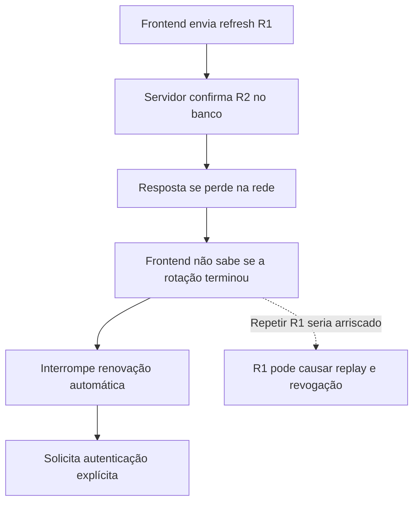

<a id="persistencia"></a>

## M. Como os registros se relacionam e por que cada dado existe

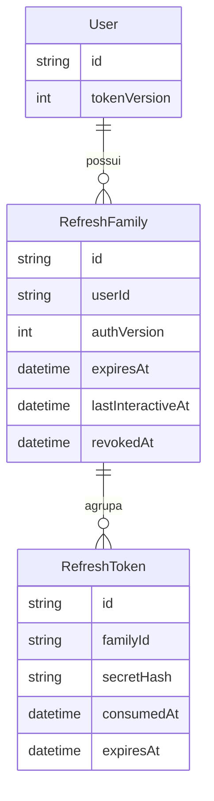

Esse diagrama é conceitual e abreviado. `o{` significa que um registro pode ter vários registros relacionados. Um usuário pode ter vários logins; cada login pode ter vários tokens ao longo da rotação. A referência da Parte II lista os demais campos.

| Campo ou grupo | Exemplo de pergunta que ele permite responder |
|---|---|
| `RefreshFamily.id` | Qual login deve ser encerrado ao revogar este dispositivo? |
| `userId` | Esta família realmente pertence ao usuário do JWT? |
| `authVersion` | O login ainda corresponde à geração atual de credenciais? |
| `createdAt` | Quando este acesso foi iniciado? |
| `expiresAt` | Qual é o limite final, mesmo com atividade constante? |
| `lastInteractiveAt` | O login passou do período permitido sem interação? |
| `mfaVerifiedAt` | Este login concluiu o segundo fator necessário? |
| `reauthenticatedAt` | A pessoa confirmou identidade recentemente para uma ação sensível? |
| `revokedAt` | Este login foi encerrado explicitamente? |
| `revokedReason` | Qual motivo foi registrado para o encerramento? |
| `userAgent`, `ipAddressHash` | Quais indícios ajudam a reconhecer o acesso sem guardar o IP bruto nesse campo? |
| `RefreshToken.secretHash` | O segredo apresentado corresponde a um token conhecido? |
| `RefreshToken.consumedAt` | Ele é atual ou já foi usado numa rotação? |
| `RefreshToken.createdAt` | Quantas emissões ocorreram na janela do limitador? |
| `RefreshToken.expiresAt` | Esse token ainda está dentro do prazo permitido? |

Hash de IP não é anonimização garantida: o espaço de valores pode permitir correlação ou tentativa de descoberta. `userAgent` também não é prova de identidade, pois pode ser informado pelo cliente. Esses metadados não substituem assinatura, segredo e estado de autorização.

Tokens consumidos não devem ser removidos imediatamente, porque são necessários para reconhecer reutilização. Ao mesmo tempo, o histórico não deve crescer sem política de retenção. O código desta mudança não implementa uma rotina de expurgo; essa é uma responsabilidade operacional a definir, preservando a detecção durante o prazo da família.

## N. Onde encontrar cada responsabilidade no código

Os caminhos abaixo são relativos à raiz do repositório indicado. Servem como um roteiro para aprofundar a leitura, sem precisar entender todos os arquivos de uma vez.

| Repositório e arquivo | O que procurar |
|---|---|
| Backend: `src/security/session/session.controller.ts` | Endpoints, cookies, resposta pública e verificações próprias de refresh/logout |
| Backend: `src/security/session/use-cases/start-session.use-case.ts` | Senha, conta, limite de tentativas e decisão de MFA |
| Backend: `src/security/session/use-cases/verify-mfa-challenge.use-case.ts` | Continuação do desafio de login |
| Backend: `src/security/session/session-auth.guard.ts` | Caminho único de autenticação das rotas privadas |
| Backend: `src/security/session/access-token.service.ts` | Emissão e validação criptográfica do JWT |
| Backend: `src/security/session/session.service.ts` | Validação da família, rotação, revogação e atividade |
| Backend: `src/security/session/prisma-auth-session.repository.ts` | Busca do estado persistido e do contexto atual |
| Backend: `src/security/session/session-cookie.service.ts` | Configuração e leitura do cookie de refresh |
| Backend: `src/security/session/csrf.guard.ts` e `csrf.service.ts` | Verificação genérica e proteção de pré-autenticação |
| Backend: `src/security/session/refresh-rate-limit.service.ts` | Limitação compartilhada das tentativas de refresh por IP |
| Backend: `src/security/session/session.config.ts` | Prazos, origens e configuração de sessão/MFA |
| Backend: `prisma/schema.prisma` | Estrutura de dados e relações |
| Frontend: `src/shared/api/client.ts` | Memória do JWT, bearer, renovação, Web Locks, canal entre abas e tratamento de erro |

## O. Roteiro de verificação para quem está aprendendo

Use uma conta e dados de teste. Não copie tokens para sites externos de decodificação, mensagens ou capturas compartilhadas. O painel Network do navegador permite observar nomes de rotas e status sem divulgar seus segredos.

1. **Entrar:** observe `POST /auth/sessions`. Se MFA estiver exigido, identifique a etapa intermediária e `POST /auth/mfa/verify`. Só depois há acesso clínico.
2. **Consultar:** abra pacientes. Observe o cabeçalho Authorization e a resposta da API. Ter o cabeçalho não dispensa a consulta central feita pelo backend.
3. **Recarregar:** confirme que a aplicação consegue reconstruir o acesso pelo refresh, sem persistir o JWT em localStorage.
4. **Renovar:** aguarde o JWT expirar mantendo interação suficiente para não atingir inatividade. Na próxima chamada, observe a rejeição por expiração, o refresh e a repetição autorizada.
5. **Revogar outro dispositivo:** use dois navegadores/perfis de teste. Revogue o segundo a partir do primeiro. Uma nova consulta do segundo deve ser negada mesmo que seu JWT tenha sido emitido há poucos segundos.
6. **Retirar uma permissão:** com uma conta administrativa de teste, retire um papel necessário de outra conta. Verifique uma operação que depende desse papel; ela deve considerar o estado atual sem esperar novo login.
7. **Testar inatividade:** deixe a aba sem interação durante o prazo configurado. Atualizações automáticas não devem manter a família utilizável.
8. **Sair:** confirme a resposta do logout e a remoção do acesso local. Em cenário controlado de rede indisponível, confira que a interface diferencia saída local de revogação remota não confirmada.

Essas observações complementam os testes automatizados. A homologação de HTTPS, cookies e múltiplas abas precisa ocorrer no navegador e na topologia real de hospedagem.

# Parte II — Referência técnica da implementação

## 1. Uma regra para toda rota protegida

Toda requisição autenticada, incluindo GET e HEAD, precisa de **JWT válido e autorização atual no PostgreSQL**. Não existe distinção entre leitura comum e leitura sensível. Apenas endpoints explicitamente públicos dispensam o guard de autenticação; login, MFA e refresh continuam com suas próprias verificações.

O fluxo é:

1. `SessionAuthGuard` verifica assinatura, emissor, audiência e validade do JWT.
2. Busca `RefreshFamily` pela chave primária indicada por `sid`, junto do contexto atual do usuário.
3. Confere titular (`sub`), revogação, expiração absoluta, inatividade, versão de autenticação, conta/organização ativas e política MFA.
4. Exige que a organização atual corresponda a `org` do token.
5. Preenche `request.user` com a identidade e os papéis **do banco**. `PoliciesGuard` e os casos de uso continuam aplicando autorização e isolamento por organização/recurso.

Depois de uma revogação confirmada no banco, uma nova validação de acesso recusa também a leitura de dados clínicos. Não é necessário aguardar a expiração de cinco minutos. Se a consulta central falhar, a requisição falha sem liberar dados; não há fallback para as claims nem cache de autorização entre requisições.

A garantia pressupõe consultas ao banco primário, sem réplica com atraso para autorização. Não desfaz uma requisição que já passou pela verificação nem apaga dados recebidos anteriormente pelo navegador. Não equivale a cancelamento transacional de todas as operações em andamento.

## 2. O que ficou mais simples

| Antes | Agora |
|---|---|
| Guard escolhia entre verificação local e central | Um único fluxo de verificação central |
| Decorator `FreshAuthorization` e classificação por método/rota | Removidos; toda rota privada segue a mesma regra |
| Permissões podiam vir do JWT ou do banco | Banco como única fonte de autorização |
| JWT duplicava papéis, tipo, profissional, versão e evidência MFA | JWT contém somente identificação, vínculo e validade |
| Fallback Passport/HS256 configurável | Removido; somente o access token RS256 vinculado à família é aceito |
| `/auth/login` emitia tokens legados sem família | Endpoint removido (404); login único em `/auth/sessions` com MFA quando exigido |

Foram retirados o guard/strategy legado, serviço e interfaces de geração legada, factory, estratégias por tipo de usuário e DTOs/caso de uso exclusivos daquele login. `AUTH_LEGACY_BEARER` não reativa o caminho antigo. `JWT_SECRET` e `JWT_EXPIRES_IN` deixaram de ser necessários para a autenticação da aplicação.

Não foram adicionados Redis, denylist de JWT, cache distribuído, tabela de sessão ou mecanismo de invalidação paralelo. `AuthSession` continua removida. A família de refresh já contém o estado necessário.

Existe um custo de banco por requisição autenticada. A busca principal usa o índice de `RefreshFamily.id`; o contexto inclui relações que o Prisma pode carregar com consultas adicionais. Não prometemos uma única instrução SQL nem ganho de desempenho sem medição. O critério aqui é clareza e controle de acesso, adequado à escala atual.

## 3. Credenciais e armazenamento

### JWT de acesso

`AccessTokenService` usa RSA de pelo menos 2048 bits, algoritmo fixo RS256, `typ=at+jwt` e `kid` escolhido de um mapa local de chaves confiáveis. Rejeita algoritmos diferentes, chave desconhecida, cabeçalhos extras e tokens acima de 8192 caracteres. Não consulta URLs indicadas no token.

| Claim | Uso |
|---|---|
| `sub` | Identificador do usuário, comparado ao titular da família |
| `sid` | Identificador da família de refresh/dispositivo |
| `org` | Organização vinculada à emissão, comparada ao contexto atual |
| `iat`, `nbf`, `exp` | Emissão, início de validade e expiração |
| `jti` | Identificador aleatório da emissão; não substitui controle central |
| `iss`, `aud` | Emissor e audiência esperados |

O TTL permanece configurável entre 30 e 300 segundos, sem tolerância adicional de relógio. A expiração emitida respeita também o teto absoluto e o prazo de inatividade da família. Esse TTL limita a credencial, mas **não é mais o prazo para efetivar revogação**.

Os novos tokens não carregam `roles`, `professionalId`, `userType`, `av`, `amr` ou `auth_time`. Essas informações são verificadas/obtidas no contexto atual. JWTs RS256 anteriores ainda válidos podem conter esses campos adicionais; o guard não os utiliza para conceder permissões e aplica a mesma verificação central. Isso permite migrar sem criar um segundo caminho de validação.

O frontend mantém o access token somente em memória e envia `Authorization: Bearer ...`. Não persiste JWT em localStorage, sessionStorage, IndexedDB, cookie ou URL. Um JWT assinado não é criptografado; não incluir dados clínicos no payload.

### Refresh token e cookie

O refresh é um segredo opaco aleatório, persistido somente como hash. Seu valor bruto é transportado exclusivamente pelo cookie HttpOnly e não aparece no envelope JSON.

Em produção: `__Host-allervia_refresh`, `HttpOnly`, `Secure`, `SameSite=Lax`, `Path=/`, sem `Domain`. Em desenvolvimento HTTP: `allervia_refresh` quando `AUTH_INSECURE_COOKIES=true`. Produção sempre exige Secure. O cookie é de sessão do navegador; os prazos efetivos são conferidos no servidor.

O cookie serve à renovação e ao logout. Ele sozinho não autentica rotas clínicas. HttpOnly dificulta extrair o segredo via JavaScript, mas não elimina os riscos de XSS no contexto da aplicação.

## 4. Fluxos preservados

| Endpoint | Comportamento |
|---|---|
| `GET /auth/csrf` | Obtém proteção de pré-autenticação ou HMAC CSRF da família conhecida |
| `POST /auth/sessions` | Valida senha e política MFA; emite desafio ou credenciais completas |
| `POST /auth/mfa/verify` | Valida desafio/código antes de emitir credenciais |
| `GET /auth/session` | Exige JWT e estado atual; retorna contexto público e CSRF, sem rotacionar tokens |
| `POST /auth/refresh` | Exige cookie, origem, JSON e CSRF; valida estado e rotaciona refresh |
| `POST /auth/session/activity` | Registra atividade interativa sem reativar uma família inválida |
| `POST /auth/logout` | Revoga a família do cookie e remove cookies; permite logout sem JWT válido |
| `POST /auth/logout-all` | Revoga todas as famílias do usuário autenticado |
| `GET /auth/sessions` | Lista os dispositivos ativos do próprio usuário |
| `DELETE /auth/sessions/:id` | Revoga uma família pertencente ao usuário |

As verificações de CSRF/origem permanecem nos endpoints de cookie. O CSRF de refresh é um HMAC vinculado à família e ao segredo privado do servidor, estável entre abas. Refresh e logout exigem origem permitida e JSON. O bearer explícito não depende de cookie/CSRF nas rotas clínicas; uma origem estrangeira informada continua sendo recusada. As respostas de autenticação usam `Cache-Control: no-store`.

### Rotação e reutilização

A renovação localiza o token pelo hash, bloqueia sua família com `FOR UPDATE`, relê o token e valida o estado. Marca o anterior como consumido e insere um único sucessor em transação. O índice parcial exclusivo reforça que exista no máximo um token não consumido por família.

Reutilizar uma credencial consumida revoga toda a família. Essa revogação é confirmada antes de retornar erro, para não ser desfeita por rollback. Uma corrida com o mesmo refresh produz no máximo um sucesso e depois revogação por reutilização. Não há período de tolerância que devolva um segredo antigo novamente.

Os limites de refresh permanecem compartilhados por IP (advisory lock e `AuthAttempt`) e por família (sob o bloqueio da rotação). Não representam um rate limit global de toda a aplicação. Proteção volumétrica pertence também à infraestrutura.

### Navegador, abas e falhas

Após reload, o cliente restaura acesso com cookie: consulta CSRF, renova e busca o contexto usando o JWT. Ausência ou invalidade de refresh resulta em novo login.

Somente `ACCESS_TOKEN_EXPIRED`, ou ausência de token na restauração de `/auth/session`, permite renovação automática. Uma chamada rejeitada pelo guard antes do caso de uso pode ser repetida uma vez, preservando corpo e chave de idempotência. Revogação, bloqueio e perda de permissão **não** provocam tentativas de contornar a decisão renovando silenciosamente.

Web Locks serializa as operações de credenciais entre abas; uma promessa compartilhada evita várias renovações simultâneas dentro da mesma aba. BroadcastChannel comunica encerramento/substituição do acesso sem transmitir tokens. Um contador local descarta respostas pertencentes à autenticação anterior. Exige navegador com Web Locks em contexto seguro (HTTPS ou localhost).

Não há repetição automática de comandos clínicos por erro de rede, 403, 429 ou 500. Uma resposta de refresh perdida tem resultado incerto; o cliente interrompe a renovação e pede autenticação explícita. Um 429 conhecido não consome a credencial e permite tentativa posterior pelo usuário.

Logout limpa o acesso local e os caches. Se a revogação remota não for confirmada, a interface informa a falha e oferece nova tentativa de encerramento. Recarregar com um cookie ainda não revogado pode restaurar o login; é necessário concluir a saída remota.

### Inatividade, MFA e revogação

O padrão continua sendo 15 minutos de inatividade e oito horas de duração absoluta. Leituras, polling e refresh não registram atividade. O web envia eventos reais de teclado/ponteiro da aba visível, limitados a uma vez por minuto; o backend também limita e verifica a atividade antes de atualizar.

Conta/organização desativadas, versão de autenticação divergente, família revogada/ausente/expirada ou MFA exigido e não confirmado impedem agora também as leituras. Papéis revogados passam a restringir as próximas requisições com o mesmo JWT. Troca/reset de senha, logout global e alterações de MFA continuam usando os fluxos de revogação existentes. Remoção de fator MFA e regeneração de códigos de recuperação exigem reautenticação recente, conforme detalhado na Parte I.

## 5. Persistência

`RefreshFamily` é o registro de um login/dispositivo, utilizado tanto para refresh quanto para autorização atual de todas as requisições protegidas.

| Campos de RefreshFamily | Função |
|---|---|
| `id`, `userId`, `user` | Identidade da concessão e titular |
| `authVersion` | Versão observada no login, comparada à conta atual |
| `createdAt`, `expiresAt` | Início e teto absoluto |
| `lastInteractiveAt` | Controle de inatividade |
| `mfaVerifiedAt`, `reauthenticatedAt` | Evidências de MFA e confirmação recente |
| `revokedAt`, `revokedReason` | Encerramento explícito e motivo |
| `userAgent`, `ipAddressHash` | Metadados limitados do dispositivo; IP em hash não equivale a anonimização absoluta |
| `tokens` | Cadeia de rotação |

| Campos de RefreshToken | Função |
|---|---|
| `id`, `familyId`, `family` | Emissão e família à qual pertence |
| `secretHash` | Busca exclusiva sem armazenar o segredo bruto |
| `createdAt`, `expiresAt` | Emissão, controle de frequência e validade |
| `consumedAt` | Distingue token atual de token reutilizado |

`AuthSession` e `User.authSessions` foram removidos pela migration `20260927010000_drop_legacy_auth_sessions`. O enum `AuthSessionRevokeReason` é compartilhado por `RefreshFamily` e não representa uma tabela. Os nomes internos `IAuthSessionRepository`, `PrismaAuthSessionRepository` e `request.authSession` descrevem agora a família; não acessam a tabela antiga.

As migrations históricas permanecem para reconstrução de bancos. A opção B não altera a estrutura persistida nem exige nova migration. Preservar tokens consumidos até o prazo absoluto da família para reconhecer replay. A retenção/expurgo posterior e de `AuthAttempt` deve ser definida operacionalmente; esta mudança não cria um agendador de limpeza. Em `AuthAttempt`, `operation=refresh-request` com `succeeded=true` representa admissão no limitador, não sucesso de login.

<a id="configuracao"></a>

## 6. Configuração e implantação

| Variável | Uso |
|---|---|
| `AUTH_JWT_PRIVATE_KEY` | PEM privado RSA em base64 |
| `AUTH_JWT_PUBLIC_KEYS` | JSON de `kid -> PEM público em base64` |
| `AUTH_JWT_KEY_ID` | Chave ativa; padrão `allervia-1` |
| `AUTH_JWT_ISSUER`, `AUTH_JWT_AUDIENCE` | Padrões `allervia` e `allervia-api` |
| `AUTH_ACCESS_TTL_SECONDS` | Inteiro entre 30 e 300; padrão 300 |
| `AUTH_REFRESH_CSRF_SECRET` | Segredo aleatório independente, mínimo de 32 bytes |
| `AUTH_REFRESH_MAX_PER_MINUTE` | Emissões por família na janela; padrão 30, incluindo a emissão inicial |
| `AUTH_REFRESH_IP_MAX_PER_MINUTE` | Tentativas por IP na janela; padrão 120 |
| `SESSION_IDLE_TIMEOUT_MINUTES`, `SESSION_ABSOLUTE_TIMEOUT_HOURS` | Padrões 15 minutos e oito horas |
| `AUTH_ALLOWED_ORIGINS` | Origens exatas permitidas, separadas por vírgula |
| `TRUST_PROXY` | IPs/CIDRs de proxies confiáveis; vazio ignora cabeçalhos encaminhados |
| `AUTH_INSECURE_COOKIES` | Exceção exclusivamente para HTTP de desenvolvimento |
| `AUTH_MFA_ENFORCEMENT`, `MFA_ENCRYPTION_KEY` | Política MFA e chave de proteção dos fatores |

### Como interpretar as configurações

Uma variável de ambiente é uma configuração fornecida ao processo do backend. Ela não deve ser confundida com um campo enviado pelo frontend: o usuário não escolhe por requisição o algoritmo, a chave ou o tempo máximo de validade. No desenvolvimento, o arquivo privado `.env` é uma forma de fornecer essas variáveis; na hospedagem, elas devem vir do ambiente privado do serviço.

| Grupo | Explicação e efeito de uma alteração |
|---|---|
| Chaves JWT | `AUTH_JWT_PRIVATE_KEY` contém o PEM privado codificado em base64. `AUTH_JWT_PUBLIC_KEYS` é um JSON que associa identificadores às chaves públicas também em base64. A chave pública do `AUTH_JWT_KEY_ID` ativo precisa corresponder à privada; configuração inconsistente impede a inicialização do serviço de tokens. Não colocar a chave privada no frontend. |
| Emissor e audiência | `AUTH_JWT_ISSUER` e `AUTH_JWT_AUDIENCE` identificam o emissor e o destinatário esperados. Não são obrigatoriamente endereços de rede. Alterá-los faz tokens emitidos com os valores anteriores falharem na verificação. |
| Duração do access token | `AUTH_ACCESS_TTL_SECONDS` usa segundos; 300 equivale a cinco minutos. O serviço rejeita valores fora do intervalo inteiro de 30 a 300. Aumentar ou reduzir o TTL não muda a regra de consulta central nem reativa famílias revogadas. |
| CSRF de refresh | `AUTH_REFRESH_CSRF_SECRET` é independente da chave JWT. Ele permite derivar o valor CSRF da família. Instâncias que atendem o mesmo ambiente precisam ter configuração consistente; uma troca deve ser coordenada porque muda os valores esperados. |
| Limites de refresh | O limite por IP conta admissões de tentativas na janela; o limite por família conta emissões recentes, incluindo a inicial. Vários usuários atrás do mesmo IP podem compartilhar o primeiro limite. Não são limites globais de todas as rotas. |
| Inatividade e duração absoluta | As unidades são minutos e horas, respectivamente. A duração absoluta vira `expiresAt` ao criar a família: alterar a configuração não reescreve retroativamente esse campo nos registros já existentes. O limite de inatividade é comparado com a configuração atual na validação. |
| Origens | `AUTH_ALLOWED_ORIGINS` contém origens completas, como `https://app.example.test`, separadas por vírgula. Não é lista de caminhos. Autorizar uma origem deve corresponder ao frontend que realmente pode operar contra aquele ambiente. |
| Proxy | `TRUST_PROXY` descreve quais proxies intermediários são confiáveis. Isso influencia a interpretação de IP/protocolo encaminhados. Aceitar cabeçalhos de qualquer remetente permitiria informações falsas afetarem, por exemplo, limites por IP. |
| Cookie de desenvolvimento | `AUTH_INSECURE_COOKIES=true` permite o cenário local HTTP fora de produção. Com `NODE_ENV=production`, a configuração exige cookie seguro. Isso não dispensa HTTPS na implantação. |
| MFA | `AUTH_MFA_ENFORCEMENT` aceita `required` ou `optional`; o padrão é required em produção e optional fora dela. `MFA_ENCRYPTION_KEY` deve decodificar para 32 bytes. Sem chave adequada, operações que precisam cadastrar/proteger fatores não podem ser tratadas como disponíveis. A exigência por tipo de usuário está explicada na Parte I. |

Outras configurações do mesmo fluxo, lidas por `SessionConfig`:

| Variável | Padrão | Significado |
|---|---|---|
| `AUTH_PREAUTH_TTL_MINUTES` | 5 | Prazo dos desafios de pré-autenticação e do cookie CSRF de pré-autenticação |
| `AUTH_CHALLENGE_MAX_ATTEMPTS` | 5 | Limite configurado para tentativas em um desafio |
| `AUTH_LOGIN_MAX_ATTEMPTS` | 10 | Limite usado pelo serviço de tentativas de autenticação |
| `AUTH_LOGIN_WINDOW_MINUTES` | 15 | Janela temporal desse controle de tentativas |
| `AUTH_REAUTH_MAX_AGE_MINUTES` | 5 | Por quanto tempo a confirmação de identidade é considerada recente |

Os números lidos pelo helper `positiveNumber` de `SessionConfig` usam o padrão quando recebem valor ausente ou inválido/não positivo; os limites de refresh também são arredondados para inteiros positivos. Isso difere da validação estrita do TTL no serviço JWT. Ao configurar um ambiente, conferir os valores efetivos evita achar que um texto inválido ativou uma política diferente.

### Implantação em várias instâncias

Uma instância é uma cópia em execução do backend. Um balanceador pode distribuir requisições entre várias delas. Como a autorização consulta PostgreSQL, todas precisam enxergar o mesmo estado atualizado e utilizar chaves e parâmetros coerentes para o ambiente.

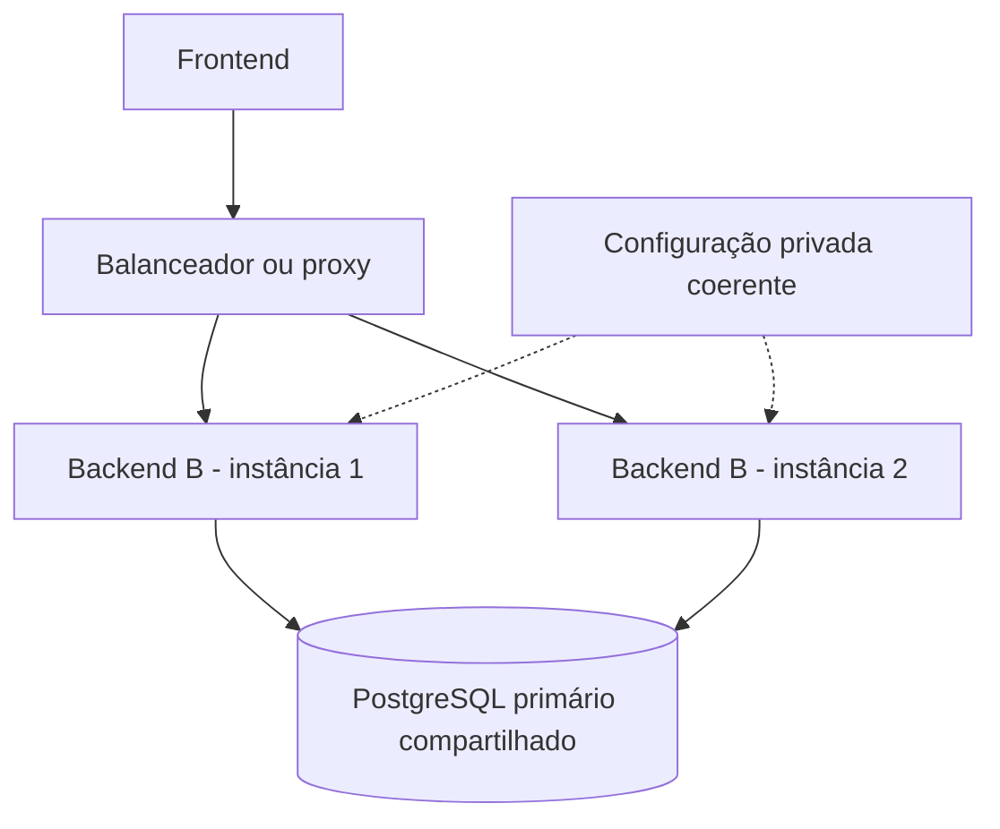

O bloqueio de rotação no banco coordena as instâncias. O bloqueio Web Locks coordena abas no navegador. São problemas diferentes: um não substitui o outro. Não há requisito de manter toda requisição de um navegador na mesma instância para a memória local decidir autorização; o estado relevante está no banco.

O script `node scripts/configure-jwt-development.cjs` provisiona chaves locais no `.env` ignorado, sem imprimir ou substituir segredos existentes e recusando produção. Em produção usar gerenciamento privado de segredos, nunca `VITE_*`. `JWT_SECRET`, `JWT_EXPIRES_IN` e `AUTH_LEGACY_BEARER` antigos podem ser retirados: não são lidos pela autenticação atual.

Para trocar A por B: publicar este backend em **todas** as instâncias; a versão atual do frontend já envia bearer e trata erros de revogação. Enquanto houver uma instância A no balanceador, ela ainda poderá aceitar leitura residual. Não usar leitura replicada com atraso para autorização. Não é necessário recriar famílias, trocar chaves ou forçar logout para esta mudança.

As URLs de login do web continuam `/auth/sessions` e `/auth/mfa/verify`. Clientes externos que ainda usam `/auth/login` ou JWT legado precisam migrar; não existe flag que reative esse acesso. JWTs RS256 emitidos pela opção A continuam sujeitos ao estado atual, mesmo carregando claims extras.

HTTPS, origens restritas, configuração correta do proxy, PostgreSQL compartilhado e relógios sincronizados continuam necessários. Preferir frontend/API na mesma origem via proxy; sites distintos podem bloquear cookies SameSite=Lax. Não registrar Authorization, cookies, senhas nem tokens em logs. CSP e prevenção de XSS no frontend continuam responsabilidades da aplicação/hospedagem, sem alegação de certificação OWASP ou conformidade jurídica automática.

Rotação de chave: distribuir a chave pública nova a todos os verificadores, mudar chave privada ativa/`kid`, aguardar o TTL desde a última emissão antiga e retirar a chave pública anterior. Em comprometimento, retirar a chave afetada de todas as instâncias e tratar o incidente. Não fazer rollback para a opção A sem aceitar novamente a janela residual. Retornar ao sistema antigo de `AuthSession` exigiria restaurar estrutura/histórico apagados, não apenas trocar o código.

<a id="testes"></a>

## 7. Testes e verificação manual

Os testes cobrem GET/HEAD após revogação, logout, conta/organização bloqueadas, versão alterada, família ausente, papéis atuais com o mesmo JWT, ausência de atualização de atividade em leitura e falha fechada quando o banco está indisponível. Mantêm as verificações de assinatura/claims temporais, MFA, concorrência/replay de refresh, CSRF e propriedade de dispositivos. O contrato do web contra Nest real agora exige 401 também na leitura de doses após logout.

Para verificar manualmente: entrar, abrir duas abas, revogar o dispositivo ou bloquear a conta em outra sessão e tentar consultar pacientes/doses. A próxima requisição deve falhar mesmo que o JWT ainda não tenha expirado. Depois, confirmar que o fluxo normal de refresh continua funcionando e que polling não mantém login inativo. Dados já renderizados não são apagados remotamente antes de uma notificação ou nova requisição; o servidor controla novas entregas de dados.

Validação executada em 27/09/2026 para a opção B:

- Build do Nest e lint dos arquivos envolvidos: aprovados.
- Testes unitários: 7 suítes, 137 testes aprovados.
- Testes de integração: 37 suítes, 216 testes aprovados.
- Contrato frontend/backend: orquestrador Jest aprovado, com 10 testes do consumidor web contra Nest e PostgreSQL reais; inclui leitura de doses recusada após logout.
- Inicialização com `npm run start`: aprovada; `/auth/csrf` respondeu 200 e `/account/me` sem credencial respondeu 401. O processo de verificação foi encerrado.

Testes HTTP/jsdom não substituem homologação no navegador com a infraestrutura de produção.

## 8. Referências

A validação criptográfica segue os princípios do [RFC 8725](https://www.rfc-editor.org/rfc/rfc8725.html); a rotação/reutilização do refresh usa o princípio do [RFC 9700, seção 4.14](https://www.rfc-editor.org/rfc/rfc9700.html#section-4.14). O Allervia não se apresenta como servidor OAuth/OIDC certificado. A [OWASP JWT Cheat Sheet](https://cheatsheetseries.owasp.org/cheatsheets/JSON_Web_Token_Cheat_Sheet.html) discute a necessidade de estado para invalidação: usar JWT não elimina esse compromisso. Aqui ele é assumido explicitamente para todas as requisições autenticadas.
