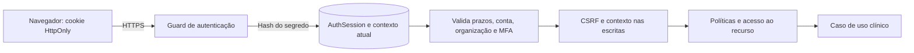
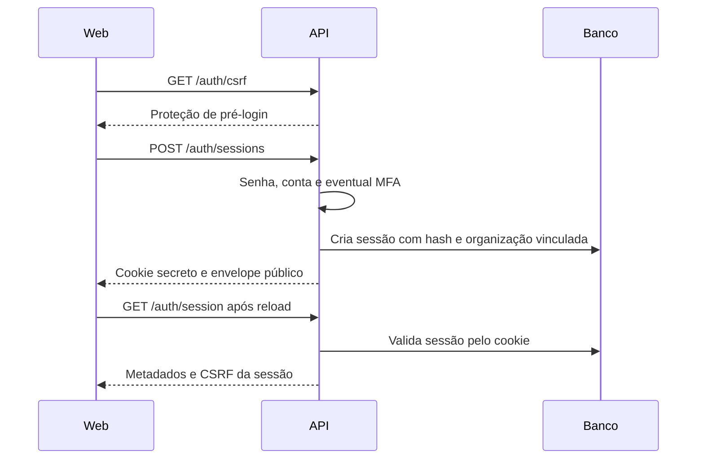

# Autenticação web do Allervia com sessão opaca

Atualizado em 29/09/2026. Implementação nos repositórios `allervia-backend` e `allervia-web`, branch `refactor/opaque-session-auth` em ambos. Este documento substitui a descrição de JWT como autenticação atual do navegador. O plano e as comparações históricas permanecem em `opaque-session-migration-plan.md`.

## 1. O que mudou

O navegador autentica chamadas por um cookie HttpOnly contendo um segredo aleatório. O backend calcula seu hash, encontra a sessão no PostgreSQL e verifica o estado atual da conta e suas permissões. Não há JWT de acesso, bearer, renovação periódica ou endpoint `/auth/refresh` no fluxo web.

O identificador público `session.id` identifica um login para listagem, revogação e detecção de mudança de contexto. **Ele não autentica ninguém.** O segredo é outra sequência, gerada por `randomBytes(32)` e codificada em base64url, com 43 caracteres. O banco guarda seu SHA-256, nunca o valor bruto.

A autenticação responde quem apresenta a credencial e se aquele login continua válido. A autorização responde se a pessoa pode realizar a operação sobre aquele recurso. O cookie não substitui as políticas nem o isolamento por organização.

## 2. Login e restauração

1. O web chama `GET /auth/csrf` para obter proteção de pré-autenticação. O servidor emite um cookie de pré-autenticação e devolve o valor de proteção no JSON.
2. Envia email e senha em `POST /auth/sessions`, com origem e cabeçalho CSRF.
3. O backend aplica os controles de tentativa, confere senha, conta e organização, e decide se exige MFA.
4. Quando necessário, o frontend apresenta o desafio ou o cadastro de MFA; `POST /auth/mfa/verify` conclui essa etapa. O desafio temporário não concede acesso clínico.
5. Somente depois dos fatores exigidos, o backend gera uma nova credencial e cria `AuthSession`.
6. O segredo segue exclusivamente em `Set-Cookie`. O JSON contém metadados de sessão e CSRF, sem JWT, hash ou segredo de sessão.
7. O frontend guarda apenas o identificador de contexto e o CSRF em memória.

Ao recarregar a página, a aplicação consulta diretamente `GET /auth/session` usando o cookie existente. Não faz refresh nem precisa recuperar um bearer. Cookie ausente ou sessão inválida exige login. Fechar o navegador não é uma garantia de revogação: o navegador pode restaurar cookies de sessão; os prazos efetivos estão no servidor.

## 3. Cookie e configuração

Em produção, o nome é `__Host-allervia_session_v2`, com HttpOnly, Secure, SameSite=Lax, Path=/ e sem Domain. Fora de produção, `AUTH_INSECURE_COOKIES=true` permite o cookie `allervia_session_v2` para desenvolvimento HTTP. O nome versionado evita colisão com cookies antigos.

HttpOnly impede leitura direta pelo JavaScript; não impede que código malicioso executado na página faça requisições. Secure protege o envio por conexão segura. SameSite limita envio entre sites, mas não substitui as verificações CSRF.

| Configuração | Responsabilidade |
|---|---|
| `AUTH_SESSION_CSRF_SECRET` | Segredo privado de ao menos 32 bytes para derivar CSRF por sessão; obrigatório e consistente entre instâncias |
| `AUTH_ALLOWED_ORIGINS` | Origens exatas autorizadas; conferir protocolo, host e porta |
| `AUTH_INSECURE_COOKIES` | Exceção local HTTP; produção sempre usa Secure |
| `SESSION_IDLE_TIMEOUT_MINUTES` | Inatividade, padrão 15 minutos |
| `SESSION_ABSOLUTE_TIMEOUT_HOURS` | Duração máxima, padrão oito horas |
| `AUTH_MFA_ENFORCEMENT`, `MFA_ENCRYPTION_KEY` | Política de segundo fator e proteção de seus segredos |
| `AUTH_PREAUTH_TTL_MINUTES`, `AUTH_CHALLENGE_MAX_ATTEMPTS` | Prazo e tentativas de desafio |
| `AUTH_LOGIN_MAX_ATTEMPTS`, `AUTH_LOGIN_WINDOW_MINUTES` | Controle de tentativas de autenticação existente |
| `AUTH_REAUTH_MAX_AGE_MINUTES` | Validade da confirmação recente, padrão cinco minutos |
| `TRUST_PROXY` | Proxies confiáveis; influencia interpretação de protocolo e IP |

`node scripts/configure-session-development.cjs` acrescenta somente o segredo CSRF local ausente, sem imprimi-lo nem substituir configuração existente, e recusa execução em produção. As configurações JWT e `AUTH_REFRESH_*` antigas não são usadas por essa autenticação. Não é necessário expor qualquer segredo como `VITE_*`.

## 4. Validação de cada requisição

`SessionAuthGuard` aceita apenas o cookie de sessão. Valores malformados e cookies duplicados são rejeitados. Bearer, corpo, URL e identificador público não são alternativas de autenticação.

O repositório consulta a sessão por `secretHash`, incluindo o contexto atual do usuário. São verificados: revogação, prazo absoluto, inatividade, versão da conta, conta ativa/não arquivada, organização ativa, vínculo à organização de emissão e exigência de MFA. Papéis vêm do banco.

Uma organização diferente da registrada em `AuthSession.organizationId` exige novo login; o acesso não acompanha silenciosamente uma transferência de clínica. O guard também compara `X-Session-Context`, quando apresentado, ao identificador da sessão. Divergência retorna `SESSION_CONTEXT_CHANGED` antes de executar o caso de uso.

O banco primário é uma dependência por requisição privada. Não existe fallback para claims, estado de outra instância ou cache que admita atraso de revogação. A consulta Prisma pode envolver múltiplos SQLs para relações; não é descrita como uma única instrução SQL garantida.

## 5. CSRF e contexto: o que o frontend precisa enviar

Como o navegador envia cookies automaticamente, operações autenticadas de escrita precisam provar condições adicionais. O `CsrfGuard` verifica origem e o formato informado, compara `X-CSRF-Token` com o valor da sessão e exige `X-Session-Context` correspondente. O cliente envia JSON também nas mutações sem campos, usando `{}`.

O CSRF é um HMAC SHA-256 do identificador da sessão, com domínio `session-csrf:v2:` e chave privada própria. Ele não é o segredo do cookie nem concede acesso sem a sessão. É estável durante a sessão, evitando disputas de rotação entre abas.

O decorator `PreAuthCsrf` exige proteção de pré-autenticação em login, conclusão de MFA e recuperação de senha. A exigência está associada ao handler, não a uma lista de strings de URL que poderia divergir da rota. Endpoints públicos de solicitação de demonstração mantêm sua política própria; não precisam de uma sessão clínica.

`GET /auth/csrf` emite a proteção de pré-login mesmo se houver cookie autenticado. Para sair, o cliente usa `GET /auth/csrf?scope=session`: se o cookie for conhecido, obtém a proteção correspondente, inclusive para concluir saída de uma sessão já inválida. Esse endpoint não reativa a sessão.

`POST /auth/logout` faz verificações próprias de origem e JSON. Cookie conhecido exige CSRF e, quando enviado, contexto correspondente antes de revogar. Cookie ausente/desconhecido pode ser limpo idempotentemente sem revogar sessões alheias. O `SkipCsrf` desse endpoint evita apenas o guard genérico; não dispensa essas verificações.

## 6. Abas, troca de conta e falhas de rede

Não há disputa de refresh. Web Locks fica restrito a operações que mudam identidade, como login e logout, com serialização local quando a API não está disponível. A segurança do backend não depende desse recurso.

Cada aba mantém o contexto esperado. Se o cookie compartilhado mudar para outro login, uma chamada da aba antiga carrega o identificador anterior e é recusada. Mesmo sem BroadcastChannel, uma escrita com o CSRF anterior não é aceita pela nova sessão. O provider revalida ao recuperar foco; eventos entre abas limpam o estado, sem transmitir credenciais.

O contador `generation` descarta respostas iniciadas antes de uma alteração de autenticação. Isso impede uma resposta atrasada de reapresentar dados da conta anterior. Os caches clínicos são limpos na saída.

Não existem repetição automática pós-expiração nem renovação transparente. Um 401 encerra o estado local; 403 mantém a distinção entre falta de permissão e perda de autenticação. Erros de rede em escritas não causam nova tentativa automática, pois a operação pode ter sido confirmada antes de a resposta se perder.

Logout offline limpa acesso local e informa que o encerramento remoto não foi confirmado. Uma nova tentativa preserva o contexto original para não encerrar acidentalmente uma conta trocada em outra aba. O cookie ainda válido pode restaurar acesso após reload até a revogação efetiva.

## 7. Prazos, MFA e revogação

GET, polling e leitura de sessão não atualizam `lastInteractiveAt`. A atividade parte de eventos confiáveis de teclado/ponteiro em aba visível, com limitação no frontend e no backend. A duração absoluta não é prorrogada por atividade.

`POST /auth/reauthenticate` confirma senha e MFA quando cadastrado, registrando a confirmação recente. Remover fator e gerar novos códigos de recuperação continuam exigindo essa confirmação.

Ao confirmar um novo fator, a credencial da sessão atual é substituída e a evidência MFA é atualizada juntas; o navegador recebe o novo cookie. Outras sessões são revogadas pelo fluxo existente. Não há rotação periódica ou cadeia de sucessores. Se a resposta dessa alteração de segurança se perder, pode ser necessário novo login.

Logout, logout global, revogação de dispositivo, alteração de senha e bloqueio preservam seus efeitos. Após a confirmação de revogação, novas validações falham. Uma requisição que já passou pelo guard pode terminar; dados já recebidos não são apagados remotamente. Não usar réplica com atraso para decidir autorização.

## 8. Persistência

| Campo em `AuthSession` | Significado |
|---|---|
| `id` | Identificador público administrativo, não secreto |
| `secretHash` | Hash exclusivo da credencial atual |
| `userId` | Titular com relação ao usuário |
| `organizationId` | Organização vinculada à emissão, comparada ao contexto atual |
| `authVersion` | Versão da conta observada ao emitir |
| `createdAt`, `expiresAt` | Início e limite absoluto |
| `lastInteractiveAt` | Última atividade aceita |
| `mfaVerifiedAt` | Confirmação MFA daquela sessão |
| `reauthenticatedAt` | Confirmação recente de identidade |
| `revokedAt`, `revokedReason` | Encerramento e motivo |
| `userAgent`, `ipAddressHash` | Metadados limitados para reconhecimento do acesso |

Hash de IP não equivale a anonimização absoluta. Metadados do dispositivo não são prova de identidade. O modelo preserva índice único no hash e índices para dispositivos e expiração.

A migration `20260928000000_opaque_browser_sessions` é aditiva: cria a nova tabela e revoga famílias legadas ainda ativas. Não importa credenciais antigas nem altera dados clínicos. Migrations históricas permanecem intactas.

`RefreshFamily` e `RefreshToken` foram removidos do schema. A migration `20260929000000_remove_retired_refresh_tables` exclui as duas tabelas, começando pela tabela filha. As migrations anteriores continuam versionadas para preservar a sequência de instalação. Após aplicar essa limpeza, um rollback para JWT exige uma migration de recriação do schema legado e novos logins; não basta voltar o código. Não restaurar o banco clínico inteiro para recuperar autenticação. `AuthSession`, usuários e registros clínicos não são excluídos. A implementação não acrescenta um agendador de expurgo. Definir retenção operacional de sessões expiradas/revogadas e separar esse prazo do histórico clínico e da auditoria.

## 9. Arquivos e manutenção

Backend: `session-auth.guard.ts` valida cookie e contexto; `session.service.ts` concentra emissão, validação e revogação; `prisma-auth-session.repository.ts` consulta o estado; `csrf.guard.ts` protege operações; `session-cookie.service.ts` administra cookie; `session.controller.ts` mantém os endpoints. O serviço de JWT e o limitador exclusivo de refresh foram retirados.

Frontend: `src/shared/api/client.ts` envia cookie, CSRF e contexto e descarta respostas antigas; `auth.api.ts` coordena login/logout; `SessionProvider.tsx` restaura identidade, limpa caches e registra atividade. Tipos de sessão deixam de oferecer access token. Os endpoints clínicos mantêm seus contratos de dados.

## 10. Implantação e estado de validação

Aplicar migration antes do corte coordenado de backend e frontend. Drenar instâncias antigas, publicar assets compatíveis e exigir novo login. Uma instalação mista não deve oferecer fallback JWT. Cookies antigos não são lidos nem autenticam a versão nova. A saída limpa somente o cookie atual.

No desenvolvimento local, o novo segredo CSRF foi provisionado sem imprimir seu conteúdo, e a migration foi aplicada ao banco local e ao banco isolado de testes. A limpeza posterior de tabelas legadas é feita pela migration de 29/09. Não houve publicação nem push.

Resultados finais de testes e limitações são registrados no relatório `opaque-session-validation.md`. Os resultados antigos da versão JWT não são contados como evidência desta versão. Homologação de cookies em HTTPS no domínio de produção e benchmark comparativo completo permanecem verificações distintas dos testes funcionais locais.
