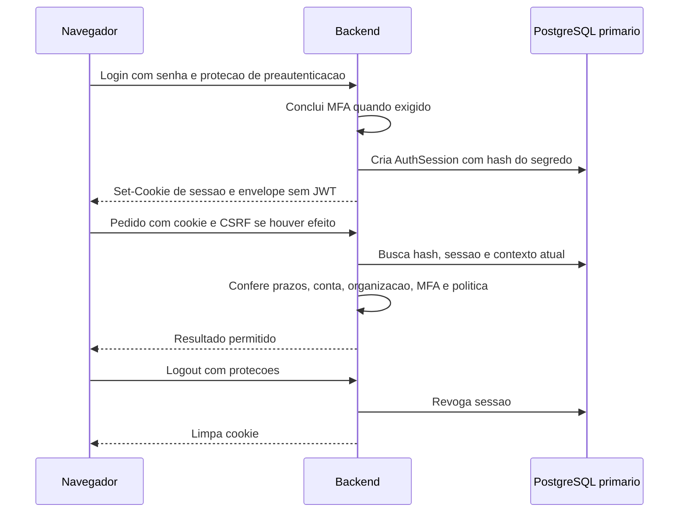

# Allervia — decisão e plano de migração para sessão opaca

Data: 28/09/2026. Atualização: 29/09/2026. Estado: implementação funcional validada localmente; benchmark de carga, homologação HTTPS, publicação e limpeza destrutiva pendentes. Escopo: `allervia-backend` e `allervia-web`.

## 1. Nomes, decisão e alcance

Neste documento, **A = JWT + refresh com consulta central em toda rota privada**, a implementação de referência anterior à migração; **B = sessão opaca em cookie HttpOnly com estado no PostgreSQL**, agora implementada localmente. Na documentação anterior, “opção B” significava o JWT com consulta central. Não confundir essa nomenclatura histórica com a comparação atual. Daqui em diante, preferir os nomes das arquiteturas a letras em títulos de PRs e decisões.

Recomendação: migrar a autenticação do web para sessão opaca, preservando MFA, autorização atual, isolamento por organização, revogação, dispositivos, reautenticação e prazos. A razão principal é reduzir mecanismos que não trazem autonomia de validação na arquitetura atual. Não há evidência de que JWT esteja incorreto ou de que a troca produza um ganho percentual de desempenho já conhecido.

A implementação só deve ser considerada concluída após cumprir os critérios funcionais, de segurança, operação e medição deste plano. A execução local é descrita em `opaque-session-implementation.md`; evidências e pendências ficam em `opaque-session-validation.md`. Publicação e limpeza destrutiva continuam separadas.

## 2. Evidência disponível e limites da conclusão

### 2.1 Fatos observados no repositório

Inspeção em 28/09/2026, HEAD backend `843959d`, com alterações locais. O SHA sozinho não identifica todo o código avaliado: o benchmark deve registrar também o diff ou um commit específico da árvore completa. Não foram consultados dados clínicos nem segredos de ambiente para este levantamento.

| Evidência | Local | Consequência para a decisão |
|---|---|---|
| Toda requisição privada verifica JWT e chama `validateFamily` | `src/security/session/session-auth.guard.ts` | O JWT atual não dispensa o banco |
| Busca de família inclui o contexto relacionado do usuário | `src/security/session/prisma-auth-session.repository.ts` | Não chamar isso de “uma única query SQL” sem medir Prisma e relações |
| Rotação consome um token, cria outro e bloqueia a família | `src/security/session/session.service.ts` | Existe escrita e coordenação extra por renovação |
| Refresh tem limitador dedicado por IP | `src/security/session/refresh-rate-limit.service.ts` | Existe um caminho operacional próprio além de login e operações clínicas |
| Cliente usa JWT em memória, promessa de refresh, Web Locks e contador de geração | `allervia-web/src/shared/api/client.ts` | Há complexidade concreta de renovação e concorrência no navegador |
| Cookie de refresh é HttpOnly, Secure em produção e SameSite=Lax | `src/security/session/session-cookie.service.ts` | Infraestrutura de cookies pode ser reaproveitada, mas seu papel de segurança muda |

Contagem local de linhas físicas, incluindo comentários e linhas vazias: `access-token.service.ts` 170; `refresh-rate-limit.service.ts` 44; `session-auth.guard.ts` 73; `session.service.ts` 373; `allervia-web/src/shared/api/client.ts` 249. São indicadores de área a revisar, **não linhas garantidamente removíveis**, qualidade de código ou complexidade ciclomática. O serviço e o cliente contêm responsabilidades que continuam necessárias.

O relatório anterior registra 137 testes unitários, 216 de integração e 10 de contrato aprovados para o JWT centralizado em 27/09/2026. Isso é evidência histórica de correção funcional daquela versão, não um benchmark e não prova sobre a sessão opaca ainda inexistente.

### 2.2 Medição local de tamanho de credencial

Foi gerado um JWT sintético com `@nestjs/jwt`, RSA de 2048 bits, `typ=at+jwt`, `kid=allervia-1`, `iss=allervia`, `aud=allervia-api`, identificadores `sub/sid/org` de 26 caracteres, `jti` de 36 e timestamps de 10 dígitos. Nenhuma chave real ou credencial de usuário foi usada.

| Item medido | Resultado |
|---|---:|
| JWT sintético serializado | 730 bytes ASCII |
| Segredo de 32 bytes em base64url sem padding | 43 caracteres ASCII |
| Diferença entre esses valores de credencial | 687 bytes, aproximadamente 94,1% |

O resultado **não significa 94,1% menos tráfego HTTP**. Nomes de headers, cookie, CSRF, outros cookies, corpo, TLS e compressão HTTP/2 ou HTTP/3 também interferem. O frontend atual usa `credentials: include`, então o cookie de refresh pode acompanhar as mesmas chamadas que já enviam bearer. Comparar bytes efetivos na rede requer captura controlada do mesmo cenário.

Essa medição é reproduzível mantendo a estrutura e os comprimentos acima; bytes da assinatura variam, mas seu comprimento permanece para a mesma chave de 2048 bits. Chaves maiores, outros identificadores e claims mudam o tamanho. Não há medição de CPU ou latência nesta etapa.

## 3. Comparação honesta entre as alternativas

| Dimensão | A: JWT centralizado | B: sessão opaca proposta |
|---|---|---|
| Prova apresentada | Token assinado no bearer | Segredo aleatório no cookie |
| Decisão atual de acesso | Assinatura + família + conta e permissões | Hash do segredo + sessão + conta e permissões |
| Consulta central | Necessária | Necessária |
| Revogação após confirmação | Recusa novas validações da família | Recusa novas validações da sessão |
| Estado persistido de credenciais | Família e cadeia de refresh | Uma linha por login; sem cadeia periódica |
| Expiração curta | JWT precisa de renovação | Não existe JWT curto para renovar |
| Recarregar página | Restauração passa por refresh | Consulta sessão usando cookie existente |
| Escritas de renovação | Consumo + inserção; controle por IP também persiste eventos | Eliminadas; atividade e eventos de segurança continuam escrevendo |
| Credencial inválida aleatória | JWT malformado pode ser recusado antes do banco | Segredo bem formado, mas inexistente, pode exigir busca por hash |
| Roubo apenas do bearer | Limitado também ao TTL curto do JWT | Cookie roubado pode durar até revogação/inatividade/teto absoluto |
| Detecção de replay | Reuso de refresh consumido revoga família | Não há sinal equivalente de reutilização da credencial estável |
| Proteção CSRF | Especialmente importante nos fluxos de cookie | Obrigatória também para as operações clínicas com efeitos |
| Abas | Coordenação para não reutilizar refresh | Sem disputa de rotação periódica; ainda há troca de conta e respostas antigas |
| Falha de resposta de refresh | Pode deixar resultado incerto e exigir login | Esse cenário específico deixa de existir |
| Falha de resposta de escrita clínica | Continua ambígua | Continua ambígua; não repetir cegamente |
| Dependência de banco disponível | Sim | Sim |
| Chaves de assinatura JWT | Necessárias | Removidas do login web; segredos de MFA/CSRF continuam |

**Inferência arquitetural:** B é mais adequada ao web atual porque o estado central já é obrigatório, e a aplicação não demonstrou necessidade de validar esse JWT autonomamente em serviços independentes. Essa conclusão vem do código e dos requisitos atuais, não de uma regra universal que prefira cookies a JWT.

**Custo que precisa ser aceito:** o segredo opaco é uma credencial reutilizável durante o login. HttpOnly reduz a leitura direta por JavaScript, mas não elimina uso indevido por XSS nem roubo do cookie por outros meios. A migração não pode ser vendida como melhora absoluta de segurança: simplifica alguns riscos e muda outros. Não adicionar rotação a cada cinco minutos para imitar refresh; isso recriaria a complexidade removida. Renovar identidade em eventos de segurança, impor prazos, reautenticação, revogação e prevenção de vazamento.

Reavaliar a escolha se surgirem clientes externos, aplicativos nativos, federação ou serviços que realmente precisem de tokens verificáveis independentemente. Uma futura integração OAuth/OIDC pode ter um fluxo próprio; não precisa obrigar o navegador atual a manter refresh manual.

## 4. Fundamento externo e interpretação

OWASP descreve identificadores de sessão imprevisíveis, sem significado de negócio, associados a estado no servidor, com expiração, invalidação e proteção contra fixação. Isso fundamenta os controles de B; não prova desempenho superior nem conformidade jurídica automática. [OWASP — Session Management](https://cheatsheetseries.owasp.org/cheatsheets/Session_Management_Cheat_Sheet.html).

Cookies são enviados automaticamente pelo navegador; operações com efeitos precisam de proteção CSRF. Validar token vinculado à sessão, origem e formato faz parte da proposta; SameSite é uma camada adicional. [OWASP — CSRF Prevention](https://cheatsheetseries.owasp.org/cheatsheets/Cross-Site_Request_Forgery_Prevention_Cheat_Sheet.html).

HttpOnly limita acesso via JavaScript; Secure restringe o transporte; o prefixo `__Host-` impõe restrições de escopo em navegadores compatíveis. São propriedades do navegador, não substitutos da validação da sessão. [MDN — Set-Cookie](https://developer.mozilla.org/en-US/docs/Web/HTTP/Reference/Headers/Set-Cookie).

O RFC 9700 trata de segurança OAuth, incluindo rotação de refresh e detecção de reutilização. Ele ajuda a explicar o benefício que A possui e B não reproduz, mas não exige que todo login web use refresh tokens. O Allervia não deve se apresentar como um servidor OAuth certificado por ter implementado mecanismos semelhantes. [RFC 9700, seção 4.14](https://www.rfc-editor.org/rfc/rfc9700.html#section-4.14).

As metas e escolhas seguintes são propostas específicas para o Allervia. Não são números prescritos por essas fontes.

## 5. Arquitetura alvo

### 5.1 Credencial e modelo

Criar **novo modelo `AuthSession`**, com nova migration posterior às existentes. Não editar nem reverter a migration histórica que apagou a tabela antiga. O novo modelo tem semântica explícita e não recupera automaticamente sessões antigas.

| Campo proposto | Finalidade e restrição |
|---|---|
| `id` | Identificador público administrativo; nunca autentica por si só |
| `secretHash` | SHA-256 de 32 bytes aleatórios codificados em base64url; índice exclusivo |
| `userId` | Titular da sessão, com relação e política de exclusão explícita |
| `organizationId` | Organização fixada no login; comparar com contexto atual, evitando troca silenciosa de clínica |
| `authVersion` | Versão da conta observada na emissão; invalidar na divergência |
| `createdAt`, `expiresAt` | Início e teto absoluto, inicialmente mantendo oito horas |
| `lastInteractiveAt` | Inatividade, inicialmente mantendo quinze minutos |
| `mfaVerifiedAt`, `reauthenticatedAt` | Evidência de segundo fator e confirmação recente |
| `revokedAt`, `revokedReason` | Encerramento e motivo, sem necessidade de apagar imediatamente |
| `userAgent`, `ipAddressHash` | Metadados limitados; sem usá-los como prova de identidade ou vínculo rígido ao IP |

Índices: exclusivo em `secretHash`; composto em `userId, revokedAt` para dispositivos; `expiresAt` para retenção. Validar cardinalidade e plano de execução antes de adicionar índices extras. O identificador aleatório tem 256 bits de entropia e 43 caracteres; validar tipo, tamanho e formato antes de calcular hash/consultar. Não aceitar IDs públicos, bearer, query string ou corpo como credenciais alternativas.

Não devolver `secretHash` nem o segredo no JSON, logs, auditoria ou ferramentas de métricas. O segredo bruto existe na emissão e no cookie recebido; o registro não precisa de operação para recuperá-lo. `User.tokenVersion` pode manter o nome atual para evitar renomeação transversal sem benefício funcional.

### 5.2 Cookie e fronteiras

Nome novo e versionado, por exemplo `__Host-allervia_session_v2`, e equivalente de desenvolvimento `allervia_session_v2`. Isso impede colisão com cookies históricos `allervia_session` e evita que limpeza legada apague acidentalmente a nova credencial.

Produção: HttpOnly, Secure, SameSite=Lax, Path=/, sem Domain, cookie de sessão. Servir frontend e API preferencialmente na mesma origem por proxy; se forem origens distintas, definir allowlist exata, `credentials: include`, CORS com credenciais e validar a topologia no navegador. Não usar `*` nem mudar para SameSite=None sem requisito e avaliação específica.

O backend busca sessão e contexto atual em uma operação de repositório; medir o número real de SQLs. Preservar falha fechada, permissões atuais e consulta ao primário. Não adicionar cache de autorização com atraso de revogação. Validação de GET não atualiza atividade.

### 5.3 CSRF deixa de ser exceção e vira regra de escrita

Remover a dispensa `if (request.user) return true` do guard CSRF: em B, `request.user` pode existir por cookie e não prova envio explícito de bearer. Para POST/PATCH/PUT/DELETE privados exigir token de sessão, origem permitida e formato adequado ao endpoint; o cliente atual é JSON. Qualquer futura exceção, como upload, exige desenho e teste próprios.

Proposta: `GET /auth/session` devolve metadados e CSRF derivado por HMAC com separação de domínio (`session-csrf:v2:<id>`), usando segredo privado dedicado. A credencial opaca nunca é esse CSRF. CSRF estável durante a sessão evita disputas entre abas. Nova sessão gera novo vínculo; invalidar estado do frontend ao trocar identidade.

Pré-login e desafio MFA usam proteção de pré-autenticação separada. Torná-la obrigatória para esses fluxos do navegador; eliminar a permissão acidental de prosseguir sem cookie de pré-autenticação. Endpoints públicos, como solicitação de demonstração, precisam de política explícita própria, sem serem obrigados a ter sessão autenticada. Fazer inventário de `Public` e `SkipCsrf`; nenhuma anotação pode ser carregada mecanicamente do refresh antigo.

Rejeitar origem ausente nas escritas autenticadas de navegador segundo o contrato definido; testes de integração devem enviar os headers reais. `GET /auth/csrf` e `/auth/session` não mudam permissões nem prolongam atividade. Respostas de autenticação usam `Cache-Control: no-store`; CORS não substitui autorização. Webhooks e clientes não navegador, se existirem, precisam de autenticação explícita e independente, não de bypass geral.

### 5.4 Fixação, MFA e mudança de identidade

Gerar novo segredo após login completo; nunca promover o valor de uma sessão anônima ou aceitar um segredo escolhido pelo cliente. Finalizar senha/MFA antes de criar a sessão autenticada. Reautenticação verifica senha/fator e atualiza evidência com prazo; eventos de elevação de privilégio ou substituição de identidade exigem novo segredo ou novo login, invalidando o anterior atomicamente. Não manter duas credenciais válidas numa janela de tolerância.

Regeneração orientada a evento pode ter resposta perdida: nesse caso, exigir novo login; não recriar rotação periódica nem cadeia de sucessores. Revogar outras sessões quando a política de alteração de MFA/senha exigir. Manter vínculo à organização e não permitir que uma sessão antiga migre silenciosamente para uma nova clínica.

## 6. Contrato HTTP e frontend

| Endpoint | Destino em B |
|---|---|
| `POST /auth/sessions` | Login; devolve cookie de sessão e envelope sem access token |
| `POST /auth/mfa/verify` | Conclui desafio e estabelece sessão opaca |
| `GET /auth/session` | Restaura/consulta sessão diretamente pelo cookie e fornece CSRF |
| `GET /auth/csrf` | Proteção de pré-login; definir resposta para sessão já ativa sem trocar cookie de identidade |
| `POST /auth/session/activity` | Mantém atividade interativa, nunca polling |
| `POST /auth/logout` | Revoga sessão conhecida e limpa cookie; com credencial conhecida exige CSRF e origem; sem credencial permite limpeza idempotente sem afetar outra sessão |
| `POST /auth/logout-all` | Revoga todas as sessões do próprio usuário |
| `GET /auth/sessions`, `DELETE /auth/sessions/:id` | Lista e revoga dispositivos do próprio usuário |
| `/auth/reauthenticate` e gestão MFA | Preservar funcionalidades e endurecer proteções de cookie |
| `POST /auth/refresh` | Remover no corte; cliente antigo recebe rota retirada, sem converter refresh automaticamente |
| Rotas clínicas | Contrato de dados preservado; credencial muda para cookie e escritas exigem CSRF |

No web, remover `accessToken`, bearer, `refreshAccess`, fila de renovação, tratamento de `ACCESS_TOKEN_EXPIRED` e repetição automática pós-refresh. Preservar `generation`/cancelamento de respostas, limpeza de caches, tratamento de 401/403, atividade, idempotência clínica e comunicação de logout. Não apagar todo o cliente porque partes dele são independentes de JWT.

Eliminar Web Locks do caminho de leituras/renovação. Avaliar coordenação curta apenas para login/logout/troca de identidade: duas abas que entram em contas diferentes compartilham cookie. A aba antiga deve limpar contexto e buscar a sessão atual ao receber evento, ao retomar foco e ao detectar mudança de identidade. BroadcastChannel transporta evento e nunca segredo; indisponibilidade do canal não pode conceder acesso indevido.

Incluir no contexto retornado `session.id`, `userId` e `organizationId`, sem dados secretos. Para impedir uma escrita de uma tela antiga sob a conta recém-logada em outra aba, enviar um identificador de contexto esperado nas escritas e compará-lo com a sessão autenticada; divergência retorna erro específico antes de efeitos. Esse identificador não autentica, apenas detecta estado desatualizado. CSRF vinculado à sessão também deve rejeitar o token da identidade anterior. Testar ambos os casos sem broadcast e com respostas atrasadas.

Ao receber 401, encerrar acesso local e pedir login; ao receber 403, mostrar proibição sem fingir expiração. Erro de rede em operação clínica não deve gerar repetição automática. Logout offline continua distinguindo limpeza local de revogação confirmada; restaurar o cookie ainda válido pode recuperar a sessão.

## 7. Métricas, fórmulas e experimento comparativo

### 7.1 O que já pode ser calculado, sem inventar benchmark

Para um login com `r` renovações bem-sucedidas, A grava uma família e `1+r` registros de refresh: **`2+r` linhas de credenciais**. B propõe **uma linha de sessão**, sem contar auditoria, MFA e tentativas de login, que continuam nos dois modelos.

Exemplo matemático, não telemetria: 8 horas com 95 renovações antes do teto absoluto geram 97 linhas em A contra uma em B. Cada renovação envolve ao menos atualizar o token antigo e inserir o novo, além do controle por IP no fluxo atual. Quantidade de renovações depende de atividade, abas, reloads e momento dos pedidos; não assumir que toda pessoa gera 95.

No cliente atual, uma consulta que recebe expiração pode percorrer: consulta rejeitada + GET CSRF + POST refresh + repetição = **quatro requisições**, desconsiderando preflight. Em B, a mesma consulta com sessão válida percorre uma. Esse ganho só vale para esse cenário, não para toda chamada. Muitas chamadas de A não encontram JWT expirado.

Não converter automaticamente linhas em bytes de disco: medir tabela, índices, retenção e WAL. Não converter tamanho de token em redução de latência sem observar a rede.

### 7.2 Métricas obrigatórias do benchmark

| Métrica | Como medir | Critério proposto |
|---|---|---|
| Correção após revogação | Requisições iniciadas após commit, em duas instâncias | Zero acessos aceitos em sessões revogadas; separar requisições que já passaram pelo guard |
| Isolamento por organização | Mesmo cookie em recursos de outra clínica | Zero recursos indevidos retornados/alterados |
| Latência p50/p95/p99 | Cliente e span de autenticação separados | B p95 não piorar mais que `max(5 ms, 10% do p95 A)` sob carga equivalente |
| Throughput sustentável | Mesma carga com limite de erros/latência | B não reduzir mais de 5%; investigar ruído antes de concluir |
| CPU e memória | Processo API, por 1.000 pedidos e pico RSS | Reportar valores e variação; sem ganho mínimo inventado |
| SQLs por pedido | Instrumentação Prisma/PostgreSQL sem parâmetros sensíveis | B não aumentar consultas de leitura de autenticação sem motivo documentado |
| Escritas por login/hora | SQLs e contadores de cenários | Zero escritas de renovação periódica; atividade contabilizada separadamente |
| Tráfego | HAR sanitizado ou captura controlada de bytes | Comparar fluxo completo com protocolo/compressão informados |
| Uso do banco | Tabelas + índices + WAL + pool de conexões | Crescimento previsível pela política de retenção, sem cadeia de refresh em B |
| Erros de uso | Login, reload, abas, rede e logout | Zero falhas nos cenários determinísticos; medir separadamente erros esperados |
| Complexidade | Diff por responsabilidade e estados removidos | Ausência de bearer/refresh no web; sem fallback duplo e sem duplicação permanente de modelos |

Os limites acima são **critérios de engenharia propostos**, não resultados nem exigências OWASP. Se a diferença estiver dentro do ruído, declarar equivalência de desempenho; a simplificação ainda pode justificar B. O desempenho não pode ser comprado removendo CSRF, contexto ou MFA da comparação.

### 7.3 Protocolo reproduzível

1. Congelar árvore A e candidata B, versões Node/PostgreSQL/Prisma, CPU/RAM, topologia, TLS, tamanhos de dados sintéticos e configuração. Usar bancos isolados com índices equivalentes; nunca banco clínico.
2. Usar clientes reais para login/CSRF; não substituir guards por mocks. Testar duas instâncias e uma origem de web com a topologia esperada. Senhas e MFA só no preparo quando o cenário for leitura; incluir o custo completo nos cenários de login.
3. Preparar cenários: GET pacientes; escrita clínica com idempotência; restauração por reload; duas e cinco abas; revogação; inatividade; JWT expirado em A; sessão válida equivalente em B; segredo inválido; rajada por IP; falha do banco.
4. Usar 1, 10, 50 e 100 usuários virtuais como pontos experimentais, não estimativa de usuários reais. Aquecer 2 minutos, medir 10 e repetir cinco vezes em ordem A/B alternada. Rodar endurance separado por pelo menos 60 minutos e teste de prazo absoluto com relógio controlado.
5. Evitar esconder espera no gerador: registrar taxa oferecida, concluída, erros, timeouts e iterações descartadas. Reportar medianas entre execuções e dispersão, além de p50/p95/p99 por cenário.
6. Capturar SQL/CPU sem parâmetros, cookies ou dados pessoais. Exportar relatório bruto e resumo em `docs/benchmarks/opaque-sessions/`, com comandos e metadados para reprodução.
7. Executar navegadores suportados de verdade para cookies, múltiplas abas, SameSite e logout offline. Testes HTTP/jsdom não substituem essa etapa.

Tabela de resultados a preencher na execução:

| Resultado | A | B | Estado |
|---|---|---|---|
| p95 GET pacientes | Não medido | Não implementado | Pendente |
| CPU por 1.000 pedidos | Não medido | Não implementado | Pendente |
| Queries reais por autenticação | Não medido | Não implementado | Pendente |
| Bytes completos por fluxo | Não medido | Não implementado | Pendente |
| Complexidade removida no diff final | Baseline a congelar | Não implementado | Pendente |

## 8. Etapas de implementação e critérios de saída

### S0 — Inventário e baseline

Criar branches `refactor/opaque-session-auth` nos dois repositórios, preservando alterações locais e registrando SHAs correspondentes. Inventariar clientes, origens, proxy, rotas públicas, exceções CSRF, handlers de 401, MFA, alteração de senha/status, dispositivos, exportações e ferramentas internas que usam bearer. Capturar contrato OpenAPI, testes atuais e métricas A. Não pressupor que não existem clientes externos: confirmar por inventário e telemetria sem segredos.

Saída: checklist de consumidores, baseline reproduzível e lista de arquivos afetados. Nenhuma alteração de comportamento em produção.

### S1 — Modelo e persistência

Adicionar `AuthSession` e relações/índices, gerar Prisma e implementar repositório de busca por hash com contexto atual. Preservar tipos públicos do usuário e contrato de políticas. Criar índices e migration aditiva em banco de teste; testar instalação desde zero e upgrade a partir das migrations atuais. Não importar hashes de refresh consumidos como sessões.

Saída: criação, consulta, expiração e revogação testadas; hash exclusivo; segredo nunca retornado pelo repositório. As tabelas antigas continuam disponíveis para rollback durante a transição.

### S2 — Backend: emissão, guard e CSRF

Adaptar `session.service.ts`, `session-auth.guard.ts`, `session-cookie.service.ts`, `session.config.ts`, controller, DTOs e casos de login/MFA. Implementar guard único de cookie, HMAC CSRF da sessão, política estrita de escrita e pré-login. Atualizar `CurrentSession`, decorators, dependências e envelopes. Manter políticas e casos clínicos sem mudanças de negócio.

Remover exposição/aceitação de JWT nas rotas web da candidata, sem fallback quando cookie falha. Sessão inexistente, bloqueada ou banco indisponível nunca deve cair em autenticação alternativa. Manter proteções de login por conta/IP e controle de desafios; o fim do refresh não remove rate limit do login.

Saída: cobertura de sessão, MFA, CSRF, organização fixada, versões, privilégios, inatividade e reautenticação. Validar cookies seguros no HTTP real.

### S3 — Frontend e contrato conjunto

Reescrever fluxo de `src/shared/api/client.ts` e provider de sessão para cookie; eliminar renovação e bearer. Implementar restauração, contexto esperado, CSRF, logout e tratamento de troca de identidade entre abas. Adaptar mocks, fixtures e testes de contrato. Preservar erros funcionais, formulários, chaves de idempotência e cancelamento de respostas.

Saída: login/MFA/reload/abas/dispositivos/logout funcionam contra Nest real; nenhuma credencial secreta em armazenamento JavaScript; nenhuma chamada a `/auth/refresh` pelo frontend novo.

### S4 — Segurança e regressão

Executar testes da matriz da seção 9, regressão clínica e verificações de build/lint. Testar senha alterada, conta e organização bloqueadas, MFA cadastrado/removido, perda de papel e revogação concorrente. Confirmar que consultas não prolongam atividade, que atividade expirada não revive sessão e que segredo fixado pelo atacante não é promovido no login.

Saída: zero regressão de segurança conhecida, cenários positivos e negativos aprovados. Contagem de testes é relatório, não substituto de cobertura por comportamento.

### S5 — Comparativo e preparação operacional

Implementar instrumentação e executar o benchmark A/B conforme seção 7. Publicar resultados com variância e limitações. Validar log redigido, alarmes, limites de entrada na infraestrutura e custo de credenciais inválidas bem formadas. Definir retenção e limpeza em lotes de sessões expiradas/revogadas, separada de trilha de auditoria; índices devem evitar varredura desnecessária.

Saída: metas atendidas ou desvios explicitamente resolvidos, relatório reproduzível e runbook de corte/retorno testado. Sem alegar “mais rápido” quando só houver redução de código.

### S6 — Corte coordenado

Aplicar migration aditiva antes do corte. Publicar backend e frontend compatíveis sob janela controlada; drenar instâncias A e requisições em andamento. Invalidar famílias antigas no corte e exigir novo login. Não converter refresh automaticamente: é mais simples e impede sessões antigas sobreviverem sob semântica diferente.

Usar cookie novo versionado e limpar nomes anteriores. Publicar assets com versão e evitar HTML antigo em cache; confirmar se há service worker antes de definir sua estratégia de atualização. Cliente desatualizado deve receber mensagem para atualizar/entrar, sem reativação silenciosa do mecanismo antigo. Não dividir usuários aleatoriamente entre servidores A/B incompatíveis atrás do mesmo balanceador.

Saída: todas as instâncias usam B, testes de fumaça públicos/privados/MFA/logout aprovados, banco primário correto e métricas normais. A publicação depende da etapa de autorização operacional aplicável, após resultado revisável.

### S7 — Limpeza e encerramento

Após uma janela proposta de observação de sete dias, condicionada ao volume real de uso, retirar `RefreshFamily`/`RefreshToken` em migration própria, sem apagar migrations históricas. Antes da remoção, verificar ausência de consumidores, política de retenção e necessidades de auditoria. Apagar serviço JWT, limitador dedicado de refresh, DTOs, configuração e dependências exclusivamente usadas no fluxo retirado. Manter dependências ainda utilizadas por outros recursos.

Atualizar documentação para sessão opaca atual e marcar a documentação JWT como histórica. Remover configurações JWT/refresh dos ambientes apenas após encerrada a possibilidade de rollback correspondente. Atualizar grafo do projeto após mudanças de código. Não deixar duas arquiteturas ativas “por garantia”.

Saída: um único modelo funcional de login web, contrato atualizado, configuração mínima documentada e nenhuma referência executável ao refresh/JWT desse fluxo.

## 9. Matriz mínima de testes

| Área | Casos que precisam existir |
|---|---|
| Login | Credenciais válidas/inválidas, conta/organização inativas, limite de tentativas, novo segredo após entrada |
| MFA | Obrigatório/opcional conforme política, desafio expirado/consumido, código inválido/reutilizado, recuperação, cadastro e remoção |
| Sessão | Cookie ausente, malformado, aleatório bem formado, revogado, expirado, versão antiga, organização alterada |
| CSRF | Token ausente/incorreto/de outra sessão, origem ausente/externa, JSON/form, login CSRF, logout CSRF, todas as escritas clínicas |
| Permissões | Papel retirado com mesmo cookie, recurso de outra organização, usuário sem vínculo necessário |
| Atividade | Polling e leituras não atualizam; evento interativo limitado atualiza; sessão vencida não revive; teto absoluto respeitado |
| Dispositivos | Listar apenas próprios, revogar outro/próprio, IDs alheios, logout global |
| Abas | Duas contas no mesmo navegador, respostas atrasadas, logout em outra aba, ausência de BroadcastChannel, CSRF antigo |
| Rede | Perda de resposta no login/logout/escrita, sem repetição cega, saída remota não confirmada visível |
| Operação | Duas instâncias, primário indisponível, proxy confiável e não confiável, cookies no domínio real |
| Migração | Banco novo, upgrade, cookie/JWT legado recusado, frontend antigo, rollback sem ressuscitar sessões revogadas |
| Privacidade | Ausência de segredos nos logs/JSON/auditoria/HAR de relatório; cache no-store em autenticação |

O JWT antigo válido, enviado sem cookie B, deve falhar. Um bearer inválido não pode selecionar outra política. Duplicidade de cookies com o mesmo nome deve ter comportamento definido e testado; escopo `__Host-` e nome novo reduzem colisões, mas não substituem parsing explícito.

## 10. Observabilidade, riscos e rollback

Registrar contadores por motivo de falha, latência de autenticação, falhas de restauração, rejeições CSRF, sessões emitidas/revogadas, pool e erros do banco. Usar rótulos de cardinalidade limitada; não colocar usuário, cookie, hash ou IDs de sessão em labels. Auditoria usa IDs internos quando necessários e acesso restrito; jamais segredo bruto.

Metas de segurança são invariantes: zero autorização indevida e zero escrita aceita sem proteção exigida. Para alarmes operacionais, comparar taxa de falha por usuários/tentativas reais, não apenas contagem absoluta; estabelecer limiar após baseline, evitando alarmes inventados sem volume conhecido.

| Risco | Tratamento |
|---|---|
| CSRF passa a afetar rotas clínicas | Guard e testes completos antes do corte; não preservar bypass de bearer |
| Cookie estável roubado | HttpOnly/Secure, prevenção de XSS, prazos, reautenticação, revogação e proteção de logs; reconhecer ausência de detecção equivalente a refresh replay |
| Mais consultas com credenciais inválidas bem formadas | Limitar tamanho/formato, proteção por IP na entrada e benchmark negativo; não criar cache de sessão válida com revogação atrasada |
| Cookie compartilhado muda conta de outra aba | Contexto esperado, CSRF por sessão, limpeza de estado e testes sem canal |
| Deploy misto | Corte coordenado e cookie versionado; nada de fallback permanente |
| Desempenho real pior | Instrumentar primeiro; revisar consulta/índice; adiar corte se metas falharem |
| Retenção indefinida | Limpeza em lotes com período documentado e auditoria independente |

Rollback antes da limpeza destrutiva: interromper tráfego, reimplantar backend/frontend A correspondentes, limpar cookies B e **exigir novo login em A**. Famílias revogadas no corte permanecem revogadas; não restaurar backup inteiro do banco clínico para recuperar autenticação. A migration aditiva pode permanecer sem uso até diagnóstico.

Depois de remover tabelas A, rollback exige recriar sua estrutura por migration compatível e validar o código; não é apenas trocar a imagem do servidor. Manter esse ponto de não retorno explícito no runbook. Em qualquer retorno, preservar dados clínicos e trilha de auditoria produzidos após o corte.

## 11. Critério final da decisão

Migrar porque o produto atual precisa de autorização central, e a sessão opaca permite mantê-la com menos estados de credenciais e menos caminhos de recuperação no navegador. A redução de rotação é verificável estruturalmente; o ganho de latência/CPU permanece uma hipótese a medir.

O resultado só será melhor se a remoção de JWT/refresh vier acompanhada de CSRF correto, identidade estável entre abas, prazos e revogação preservados, corte seguro e observabilidade. Se o benchmark mostrar desempenho equivalente, isso não invalida a escolha: menor complexidade pode ser a justificativa principal. Se revelar regressão relevante ou dependência real de JWT em consumidores, resolver esses pontos antes da publicação.
